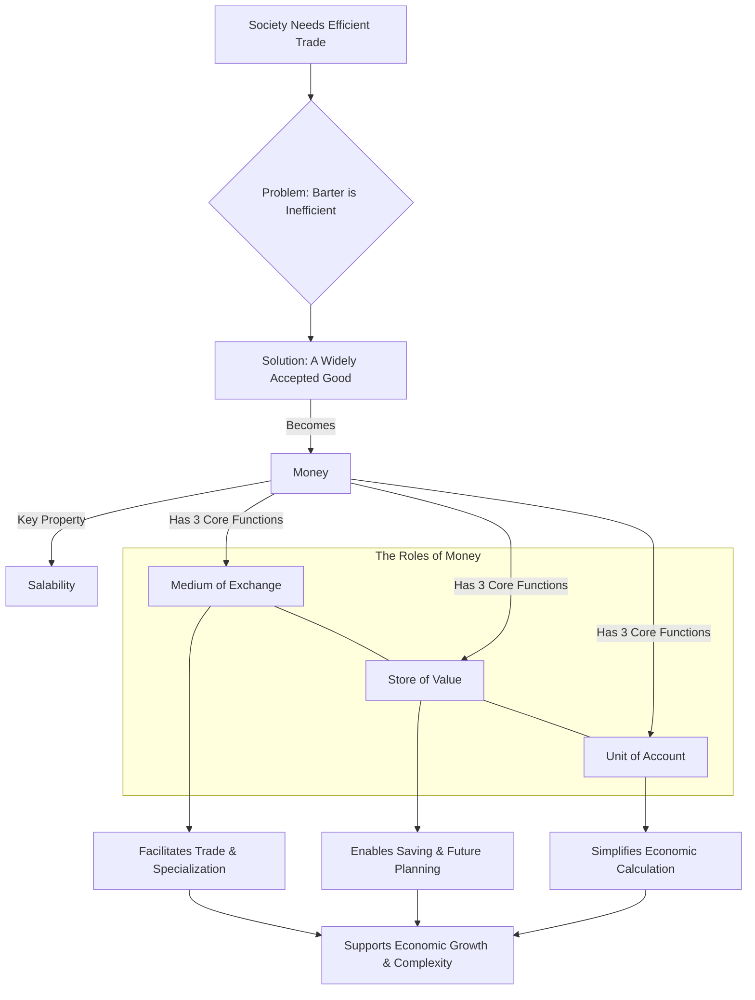

# Chapter 1: What is Money?

Chapter 1 of "The Bitcoin Standard" doesn't immediately dive into Bitcoin. Instead, it wisely starts by laying a crucial foundation: understanding the fundamental nature and purpose of **money** itself. The core idea is that before we can evaluate Bitcoin or any other form of currency, we need to grasp what money _is_ and _why_ it exists.

**The Problem: The Inefficiency of Barter**

Imagine trying to trade goods directly without money (barter). If you raise chickens and need shoes, you must find someone who not only _has_ shoes but also _wants_ your chickens right now. This "double coincidence of wants" makes trade extremely difficult, limiting economic activity and specialization.

**Money as the Solution: The Medium of Exchange**

Money emerges naturally as a solution to barter's problems. The chapter defines money primarily by its core function: acting as a **Medium of Exchange**. This means it's a special type of good that people acquire _not_ necessarily for its own sake, but because they know they can easily trade it later for the goods and services they _actually_ want.

**The Key Ingredient: Salability**

What makes something suitable to become money? The book highlights the essential property of **Salability**. This refers to how easily a good can be sold or exchanged in the market at any time with minimal loss of value. Think of it as its general acceptability or marketability.

- High salability means many people are willing to accept the good in trade.
- This high acceptance makes the good **liquid** – easily convertible into other things.
- Crucially, the value of a good _as money_ comes primarily from this widespread salability, not necessarily from any other use it might have (like gold's use in jewelry).

**The Three Hats of Money**

Once a good becomes widely accepted as a medium of exchange, it typically takes on two other vital roles:

1.  **Medium of Exchange:** Its primary job – making trade smooth and efficient.
2.  **Store of Value:** Allowing individuals to save their economic energy (wealth) over time. To be a good store of value, money needs to hold its purchasing power reasonably well.
3.  **Unit of Account:** Serving as a common benchmark or yardstick to price goods, record debts, and make economic calculations. This simplifies comparing the value of vastly different items.

**Why Good Money Matters**

The chapter suggests (drawing on Austrian economic thought) that when a society converges on using a single, highly salable, and reliable medium of exchange (i.e., "sound money"), it unlocks significant economic progress. It enables:

- **Deeper Specialization:** People can focus on specific skills, knowing they can easily trade their output for everything else they need.
- **Wider Trade Networks:** Commerce can expand beyond local communities.
- **Capital Accumulation:** Saving becomes more effective, allowing for investment in more complex production processes.
- **Rational Economic Calculation:** Businesses and individuals can plan more effectively.

**In Short:** Chapter 1 defines money not by what it _is_ made of, but by what it _does_. By establishing its core functions (especially as a medium of exchange) and the importance of salability, it sets the stage for later chapters to analyze different historical forms of money (like shells, gold, government fiat currency) and ultimately evaluate how Bitcoin measures up against these fundamental properties.
