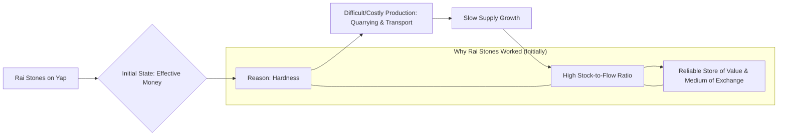
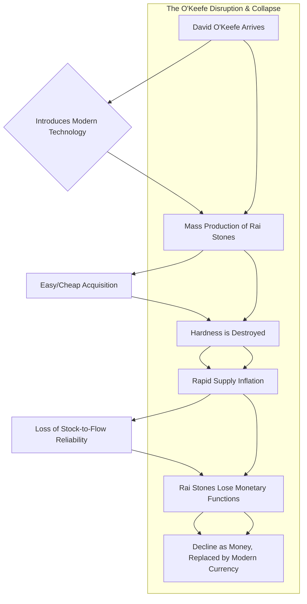

# Chapter 2 - Primitive Money and the Stones of Yap

Chapter 2 takes us on a journey back in time, exploring **primitive forms of money** to uncover timeless principles about what makes a good currency. The central and most striking example used is the unique monetary system of the **Rai stones on the Island of Yap**.

**Yap's Giant Stone Money: A Precursor to Digital Ledgers?**

Imagine using massive, wheel-shaped limestone stones, some weighing several tons, as money! This was the reality on Yap. These Rai stones weren't typically carried around. Instead, ownership was tracked through **shared social consensus** – everyone essentially knew who owned which stone, or parts of stones, even if the stones themselves were sometimes lost at sea or remained in a fixed location. The book draws a fascinating parallel here: this reliance on a collective, public ledger bears a conceptual resemblance to how Bitcoin transactions are recorded on its blockchain (though the technology is vastly different).

**Why Did Rai Stones Work? The Secret Ingredient: Hardness**

Initially, Rai stones functioned effectively as money for one crucial reason: **Hardness**. This doesn't primarily mean physical hardness, but rather the **difficulty of producing _new_ stones**.

- **Costly Production:** Quarrying the limestone and, more importantly, undertaking dangerous sea voyages to transport these massive stones from the island of Palau (hundreds of kilometers away) required immense effort, resources, and risk.
- **Limited Supply Growth:** Because they were so hard to create, the total number of Rai stones (the **stock**) increased very slowly compared to the existing supply. This relationship is often described as the **Stock-to-Flow ratio**. A high stock-to-flow ratio means the existing supply is large relative to new production, making the money supply predictable and reliable.
- **Result:** This difficulty of inflation made Rai stones a good **Store of Value** and a trusted **Medium of Exchange** on Yap. People accepted them because they were confident that their value wouldn't suddenly evaporate due to a flood of new stones.

**The Arrival of Easy Money: David O'Keefe's Disruption**

The story takes a dramatic turn with the arrival of David O'Keefe, an Irish-American sea captain. Shipwrecked on Yap, he wanted to trade for local resources like coconuts but found the Yapese weren't interested in typical foreign goods or money. Observing their reverence for Rai stones, O'Keefe hatched a plan.

Using modern tools, ships, and even explosives, O'Keefe could quarry and transport Rai stones from Palau far more easily and cheaply than the Yapese could traditionally. He then used these "mass-produced" stones to pay the islanders for their labor and goods.

**The Downfall: When Hard Money Becomes Easy**

This influx of easily acquired stones fundamentally undermined the Rai monetary system:

1.  **Initial Resistance:** Yapese elders, recognizing that O'Keefe's stones lacked the traditional hardship and proof-of-effort associated with their creation, initially resisted accepting them. They understood, perhaps intuitively, that the _difficulty_ was part of what gave the stones value.
2.  **Inflation Takes Hold:** Despite initial reluctance, some Yapese began trading with O'Keefe. As more and more easily-produced stones entered circulation, the overall supply rapidly increased. The "hardness" of Rai money was destroyed.
3.  **Loss of Monetary Function:** The predictability and scarcity vanished. Rai stones lost their reliability as a store of value and eventually ceased functioning as the primary medium of exchange on Yap. Conflict arose, and eventually, modern government-issued money replaced the ancient system. The stones became primarily cultural artifacts.

**The Core Lesson**

Chapter 2 uses the vivid tale of the Rai stones to hammer home a critical point: **a monetary good's resistance to easy supply increases (its hardness or high stock-to-flow ratio) is fundamental to its success.** When that hardness is compromised, whether through technology (like O'Keefe's tools) or other means, the money fails. This historical lesson serves as essential background for understanding the properties that make _other_ forms of money, including precious metals and eventually Bitcoin, potentially sound or unsound.
