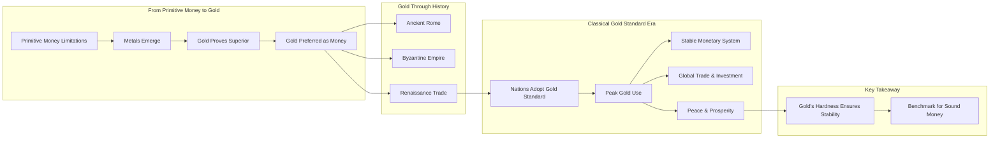

# Chapter 3: Metals as Money - The Rise of Gold

Following the exploration of primitive money, Chapter 3 pivots to the pivotal role of **monetary metals**, meticulously tracing their historical significance and illuminating why one specific metal ascended to global preeminence: **Gold**.

## Why Metals? The Imperative for Better Money

As societies scaled and trade intricate grew, the inherent limitations of early moneys – like shells or stones – became glaringly apparent. Metals offered a compelling suite of advantages, rendering them highly **salable** (easily exchangeable) and thus ideal successors:

- **Durability:** Metals resist decay, rust (especially gold), and degradation, enabling the long-term preservation of wealth across generations.
- **Divisibility:** They can be precisely divided into smaller, standardized units (like coins) without compromising their underlying value, facilitating transactions of varying magnitudes.
- **Portability:** Offering a high value-to-weight ratio compared to cumbersome alternatives, metals significantly eased the transport of wealth.
- **Fungibility:** A unit of a specific pure metal (e.g., an ounce of pure gold) is virtually identical to and perfectly interchangeable with any other unit, streamlining commerce through uniformity.
- **Recognizability:** Distinctive physical properties aided in identification and verification, curbing counterfeiting and building trust.
- **Scarcity / Hardness:** Vitally, precious metals like gold and silver possess natural rarity. Their discovery and extraction demand considerable effort, intrinsically limiting the rate at which new supply can be introduced. This characteristic generates the highly desirable **high stock-to-flow ratio**, solidifying their function as reliable stores of value.

## Gold Takes the Crown: The Apex Monetary Metal

While various metals, including silver and copper, served monetary functions, Chapter 3 compellingly argues why **gold ultimately emerged as the preferred global monetary standard**. Gold uniquely embodies the optimal blend of the aforementioned properties, demonstrating exceptional superiority in:

1.  **Extreme Durability/Inertness:** Gold's unparalleled resistance to corrosion and decay ensures its physical integrity across millennia.
2.  **Superior Scarcity & Stock-to-Flow:** Gold is exceptionally rare and its extraction is resource-intensive. Consequently, the total existing above-ground stock vastly outweighs annual production (flow). This unmatched "hardness" established it as the most dependable store of value among all metals.

## Gold Through History: Lessons Forged in Empires

The chapter vividly illustrates gold's enduring monetary power through key historical epochs:

- **Roman Golden Age & Subsequent Decline:** Highlighting the correlation between Rome's zenith of power and prosperity and its use of sound gold (Aureus) and silver (Denarius) coinage. Conversely, the narrative links the empire's later debasement of currency – reducing precious metal content – to rampant economic instability and eventual decline.
- **Byzantium and the Enduring Bezant:** Underscoring the remarkable longevity of the Byzantine Empire, significantly attributed to its stable, high-purity gold coin, the Bezant (Solidus). This trusted currency facilitated international trade across vast territories for centuries, demonstrating the foundational power of reliable money.
- **The Renaissance Commercial Revival:** Demonstrating how the resurgence of trade, art, and innovation during the Renaissance was crucially lubricated by the re-emergence and circulation of dependable gold and silver coinage (like the Florin and Ducat), restoring faith in commerce.

## La Belle Époque: The Golden Age of the Gold Standard

A significant focus of the chapter is devoted to **"La Belle Époque" (The Beautiful Era)**, the period from roughly 1871 to 1914, representing the apex of the **classical gold standard**.

- **A Global Monetary Anchor:** Major world powers formally adopted gold as the bedrock of their monetary systems. National currencies were legally defined as specific weights of gold, and international balances were reliably settled using gold or currencies directly convertible into it at fixed rates.
- **An Era of Unprecedented Prosperity:** This period witnessed remarkable global peace (relative to history), vigorous economic growth, transformative technological innovation, scientific breakthroughs, and rich cultural development. The chapter contends that the stability, predictability, and trust engendered by the gold standard were fundamental catalysts for this progress.
- **Frictionless Global Commerce:** Gold's universal acceptance and the resulting stable exchange rates dramatically facilitated seamless international trade, investment, and travel. Individuals could confidently use gold coins or gold-backed notes across borders, assured of their enduring purchasing power.
- **The Foundation of Sound Money:** The chapter emphasizes that gold's intrinsic "hardness" – its natural resistance to manipulation and inflationary expansion – imposed fiscal discipline and provided a solid monetary foundation. This fostered long-term planning, encouraged capital accumulation, and built widespread economic trust. (Potential contrasts with the instability caused by attempts at bimetallism, incorporating silver alongside gold, might also be discussed).

## In Conclusion:

Chapter 3 powerfully establishes gold as the historical benchmark for sound money. Its ascent was not accidental but a market-driven outcome based on its superior physical properties, culminating in its unparalleled scarcity and high stock-to-flow ratio. By examining gold's crucial role throughout history, particularly during the prosperous zenith of the classical gold standard, the chapter forcefully articulates the benefits derived from hard money, setting a crucial standard against which other monetary systems – including modern fiat currencies and emerging digital assets like Bitcoin – can be rigorously evaluated.
