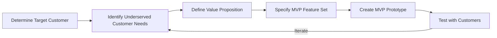
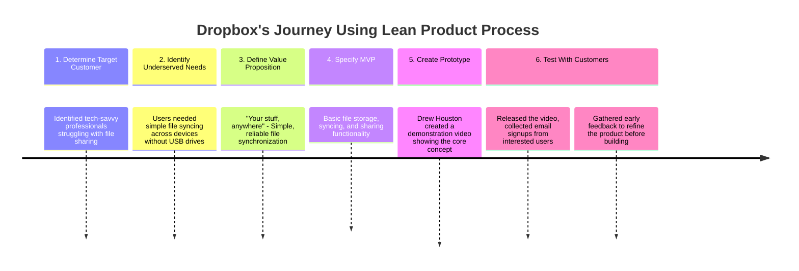

# "Lean Product Playbook" by Dan Olsen

## Overview

_"Lean Product Playbook: How to Innovate with Minimum Viable Products and Rapid Customer Feedback"_ by Dan Olsen is a comprehensive guide for product managers, entrepreneurs, and innovators aiming to create products that resonate with customers. Drawing inspiration from Lean Startup methodologies, the book offers a structured, step-by-step framework to streamline product development, minimize waste, and maximize value delivery. Olsen emphasizes the importance of understanding customer needs, iterative testing, and data-driven decision-making to build successful products.

**Main Concepts**

1. **Lean Product Process**: At the heart of the book is the Lean Product Process, a six-step framework designed to guide product development from ideation to launch. This process encourages continuous iteration based on customer feedback.

2. **Customer-Centricity**: Olsen stresses the necessity of deeply understanding the target customer, their pain points, and desired outcomes to ensure the product aligns with real needs.

3. **Value Proposition**: Defining a clear value proposition is crucial. It articulates why customers should choose your product over alternatives, focusing on the unique benefits it offers.

4. **Minimum Viable Product (MVP)**: Instead of building a full-fledged product upfront, the book advocates for creating MVPs to test hypotheses and gather feedback, thereby reducing risks and resource expenditure.

5. **Iterative Testing and Validation**: Continuous testing with real users allows for refining the product based on actual usage and feedback, ensuring alignment with market demands.

6. **Metrics and Measurement**: Establishing key performance indicators (KPIs) and metrics is essential for assessing product performance and guiding future iterations.

**Chapter-by-Chapter Summary**

1. **Introduction: The Lean Product Playbook Approach**

   - **Overview**: Introduces the Lean Product Playbook framework and its origins in Lean Startup principles. Emphasizes the shift from traditional product development to a more iterative, customer-focused approach.
   - **Key Takeaway**: Understanding the necessity of adopting a lean mindset to enhance product success rates.

2. **Chapter 1: The Lean Product Process**

   - **Overview**: Details the six-step Lean Product Process, providing a roadmap for product development.
   - **Key Takeaway**: Familiarization with the structured approach that underpins the entire playbook.

3. **Chapter 2: Determine Your Target Customer**

   - **Overview**: Focuses on identifying and understanding the specific customer segment for whom the product is intended. Discusses methods like user personas and market segmentation.
   - **Key Takeaway**: The importance of clearly defining the target customer to tailor product features effectively.

4. **Chapter 3: Identify Underserved Customer Needs**

   - **Overview**: Explores techniques to uncover the real needs and pain points of customers that are not adequately addressed by existing solutions.
   - **Key Takeaway**: Identifying underserved needs ensures the product addresses genuine gaps in the market.

5. **Chapter 4: Define Your Value Proposition**

   - **Overview**: Guides readers on crafting a compelling value proposition that succinctly communicates the product's benefits and differentiators.
   - **Key Takeaway**: A strong value proposition is crucial for attracting and retaining customers.

6. **Chapter 5: Specify Your MVP Feature Set**

   - **Overview**: Discusses how to determine the essential features that constitute the Minimum Viable Product, balancing functionality with simplicity.
   - **Key Takeaway**: Prioritizing features to develop an MVP that can effectively test core assumptions with minimal resources.

7. **Chapter 6: Create Your MVP Prototype**

   - **Overview**: Covers the creation of MVP prototypes, whether through wireframes, mockups, or actual working models, to facilitate testing and feedback.
   - **Key Takeaway**: Prototyping is a critical step for visualizing the product and enabling early-stage validation.

8. **Chapter 7: Test Your MVP with Customers**

   - **Overview**: Provides strategies for conducting user testing, gathering feedback, and analyzing results to inform product iterations.
   - **Key Takeaway**: Engaging with customers early and often ensures the product evolves in line with user expectations.

9. **Chapter 8: Iterate and Improve**

   - **Overview**: Emphasizes the cyclical nature of the Lean Product Process, encouraging continuous refinement based on feedback and performance data.
   - **Key Takeaway**: Iteration is key to adapting the product to changing market needs and improving its fit.

10. **Chapter 9: Case Studies and Real-World Applications**

    - **Overview**: Presents real-world examples of companies that have successfully implemented the Lean Product Playbook framework, illustrating practical applications.
    - **Key Takeaway**: Learning from successful case studies provides actionable insights and inspiration.

11. **Conclusion: Bringing It All Together**
    - **Overview**: Summarizes the key points of the book, reinforcing the importance of a lean, customer-centric approach to product development.
    - **Key Takeaway**: Encourages readers to adopt the Lean Product Process as a standard practice for creating products that customers love.

**Final Thoughts**

_"Lean Product Playbook"_ serves as a practical manual for anyone involved in product development. Dan Olsen effectively breaks down complex concepts into actionable steps, making the Lean Product Process accessible and implementable. By emphasizing customer understanding, iterative testing, and strategic prioritization, the book equips readers with the tools needed to navigate the uncertainties of product creation and enhance the likelihood of market success.

## Example: How Dropbox Applied the Lean Product Process

Drew Houston, Dropbox's founder, exemplified lean methodology by:

1. Creating a simple video demo instead of building the entire product
2. Validating market demand by collecting 75,000 email signups overnight
3. Incorporating user feedback into the product before fully developing it

This approach helped Dropbox achieve product-market fit rapidly while minimizing wasted development efforts.
