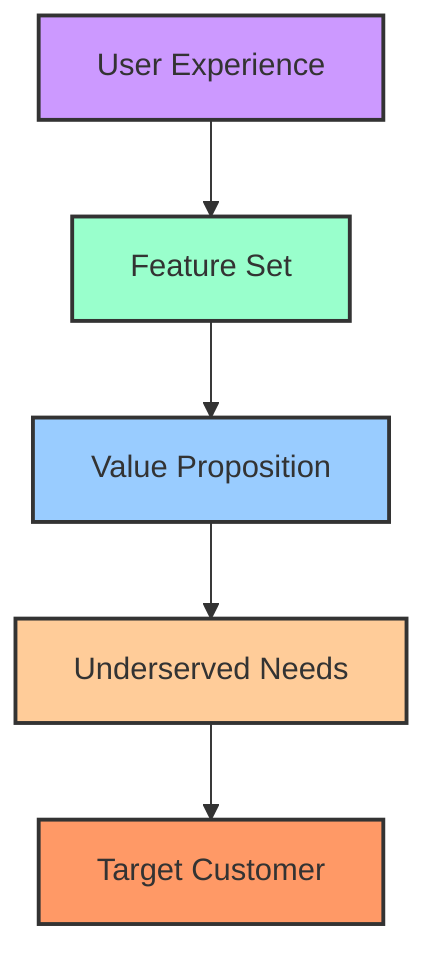
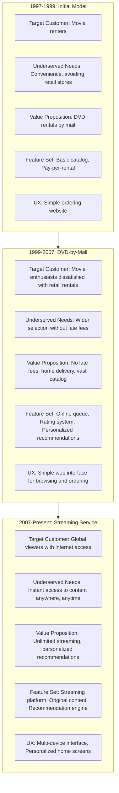
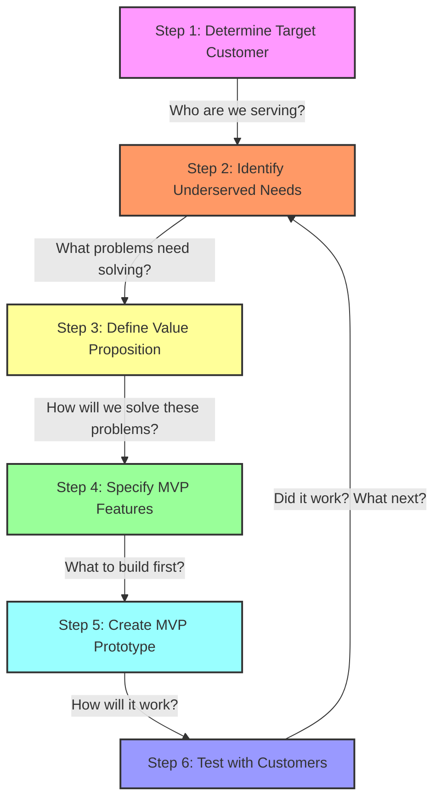
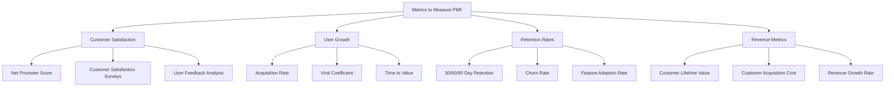

## Chapter 1 Summary: Achieving Product-Market Fit with the Lean Product Process

In Chapter 1 of _"Lean Product Playbook,"_ Dan Olsen introduces the foundational concept of **Product-Market Fit (PMF)** and how the **Lean Product Process** serves as a systematic approach to achieving it. This chapter sets the stage for the entire playbook by emphasizing the critical importance of aligning a product with the needs and desires of its target market.

### **Key Concepts**

1. **Product-Market Fit (PMF)**

   - **Definition**: PMF occurs when a product satisfies a strong market demand. It's the point where customers recognize the value of the product, leading to sustained adoption and growth.
   - **Significance**: Achieving PMF is essential for the success and scalability of any product. Without it, even the most well-funded or feature-rich products can fail to gain traction.

2. **The Lean Product Process**

   - **Six-Step Framework**: Olsen outlines a six-step Lean Product Process designed to guide product teams from ideation to achieving PMF. These steps include:
     1. **Determine Your Target Customer**
     2. **Identify Underserved Customer Needs**
     3. **Define Your Value Proposition**
     4. **Specify Your MVP Feature Set**
     5. **Create Your MVP Prototype**
     6. **Test Your MVP with Customers**

3. **Iterative Development**

   - Emphasizes the importance of building products iteratively, allowing for continuous learning and adaptation based on real customer feedback.

4. **Customer-Centric Approach**
   - Prioritizes understanding and solving real customer problems over pushing out features based on assumptions or internal biases.

### The Product-Market Fit Pyramid

The **Product-Market Fit Pyramid** is a structured framework designed to help product teams systematically achieve product-market fit. This pyramid consists of five hierarchical levels, each building upon the previous one:

1. **Target Customer**: Identifying and understanding the specific segment of customers your product aims to serve. This involves creating detailed personas that encapsulate demographics, behaviors, and pain points.

2. **Underserved Needs**: Recognizing the particular needs or problems of your target customers that are not adequately addressed by existing solutions. This requires deep customer research to uncover these gaps.

3. **Value Proposition**: Defining how your product uniquely addresses the underserved needs of your target customers, offering clear benefits that set it apart from competitors.

4. **Feature Set**: Determining the specific features and functionalities your product must have to deliver on its value proposition effectively. Prioritization is key to focus on what truly matters to your customers.

5. **User Experience (UX)**: Ensuring that the product is not only functional but also provides a seamless and engaging experience for the user, facilitating ease of use and satisfaction.

**Insights and Examples:**

- **Iterative Development**: The pyramid emphasizes an iterative approach, where each level is revisited and refined based on feedback and learning. For instance, if user testing reveals that certain features are underutilized, it may indicate a misalignment in the value proposition or a misunderstanding of customer needs.

- **Real-World Application**: Consider Slack, the team collaboration tool. Initially developed as an internal communication solution, Slack's creators identified a broader market of teams needing efficient communication tools (Target Customer). They recognized that existing solutions were either too complex or lacked real-time capabilities (Underserved Needs). Slack's value proposition centered on simplicity and real-time messaging (Value Proposition), leading to features like channels and integrations (Feature Set) within an intuitive interface (UX).

- **Continuous Alignment**: Achieving product-market fit is not a one-time event but a continuous process. As markets evolve, customer needs change, and new competitors emerge, it's crucial to revisit and adjust each level of the pyramid to maintain alignment and relevance.

By systematically addressing each level of the Product-Market Fit Pyramid, product teams can create offerings that resonate deeply with their target customers, effectively meet their needs, and provide compelling value, thereby increasing the likelihood of achieving and sustaining product-market fit.

### Example: Netflix's Evolution Through the PMF Pyramid

Netflix's journey illustrates how a company can effectively apply the Product-Market Fit Pyramid to evolve with changing market conditions:

1. **Initial DVD Rental Model (1997-1999)**:

   - **Target Customer**: Movie renters seeking convenience
   - **Underserved Need**: Avoiding trips to rental stores
   - **Value Proposition**: DVDs delivered by mail
   - **Key Insight**: This model addressed a pain point but hadn't yet achieved optimal PMF

2. **Subscription Model (1999-2007)**:

   - **Target Customer**: Expanded to movie enthusiasts frustrated with late fees
   - **Underserved Need**: Access to a wide selection without penalties
   - **Value Proposition**: Unlimited rentals, no late fees, personalized recommendations
   - **Feature Innovation**: Queue system, recommendation algorithm
   - **PMF Achievement**: This model resonated strongly with customers, growing to 6+ million subscribers

3. **Streaming Service (2007-Present)**:
   - **Target Customer**: Global viewers with internet access
   - **Underserved Need**: Instant content access, original programming
   - **Value Proposition**: Unlimited streaming on multiple devices, personalized experience
   - **Feature Evolution**: Streaming technology, original content, advanced recommendation engine
   - **UX Refinement**: Device-specific interfaces, personalization

This evolution demonstrates how consistently reassessing each level of the PMF Pyramid enabled Netflix to maintain market leadership despite significant industry disruption.

### Case Study: Slack's Journey to Achieving Product-Market Fit

Slack's evolution from an internal tool to a leading team collaboration platform exemplifies the strategic application of the Product-Market Fit Pyramid.

**1. Target Customer**

Initially, Slack was developed by Tiny Speck, a company co-founded by Stewart Butterfield, as an internal communication tool to facilitate collaboration among their geographically dispersed team during the development of the online game Glitch. Recognizing the broader applicability of their solution, they identified a target market comprising businesses and organizations seeking efficient, real-time communication tools to enhance team collaboration.

**2. Underserved Needs**

At the time, many organizations relied on traditional communication methods like email, which often led to fragmented conversations and inefficiencies. Existing chat solutions lacked integration capabilities and user-friendly interfaces. Slack identified these pain points, understanding that teams needed a centralized platform that could streamline communication, integrate with other tools, and provide a more engaging user experience.

**3. Value Proposition**

Slack positioned itself as a solution that simplifies team communication by offering:

- **Real-Time Messaging**: Facilitating instant communication among team members.
- **Channel Organization**: Allowing discussions to be segmented by projects or topics.
- **Integrations**: Seamlessly connecting with various third-party applications to centralize workflows.
- **Searchable Archives**: Enabling easy retrieval of past conversations and shared files.

This value proposition aimed to reduce reliance on email and improve overall team productivity.

**4. Feature Set**

To deliver on its value proposition, Slack incorporated features such as:

- **Channels and Direct Messages**: Organizing conversations and facilitating private communications.
- **File Sharing**: Allowing users to share documents and media within conversations.
- **Integration with Services**: Connecting with tools like Google Drive, Trello, and GitHub to streamline workflows.
- **Custom Notifications**: Enabling users to tailor alerts to their preferences.

These features were prioritized to address the specific needs of their target customers effectively.

**5. User Experience (UX)**

Slack emphasized a user-friendly and engaging interface, incorporating elements such as:

- **Intuitive Design**: Ensuring ease of navigation and use.
- **Custom Emojis and GIFs**: Adding a fun and personalized touch to communications.
- **Responsive Performance**: Providing a seamless experience across devices.

This focus on UX contributed to high user satisfaction and adoption rates.

**Achieving Product-Market Fit**

By meticulously addressing each level of the Product-Market Fit Pyramid, Slack developed a product that resonated with its target audience. The platform's rapid adoption and growth were indicative of its success in meeting the market's needs. Slack's commitment to continuous improvement and responsiveness to user feedback further solidified its position in the market.

**Insights and Takeaways**

- **Customer-Centric Development**: Slack's success underscores the importance of deeply understanding and addressing customer needs.
- **Iterative Enhancement**: Regular updates and feature additions, guided by user feedback, are crucial for maintaining product relevance.
- **Scalable Solutions**: Building a product that can adapt to various organizational sizes and industries broadens its market appeal.

Slack's journey demonstrates the effectiveness of applying the Product-Market Fit Pyramid framework to create a product that not only fits the market but also evolves with it.

### **Insights and Takeaways**

1. **PMF as a Foundation, Not a Destination**

   - **Insight**: PMF isn't a one-time milestone but a continuous objective. Markets evolve, customer needs shift, and competitors emerge, requiring ongoing efforts to maintain and enhance PMF.
   - **Takeaway**: Product teams should establish mechanisms for regular feedback and iteration to sustain PMF over time.

2. **Lean Product Process as a Blueprint for Success**

   - **Insight**: The structured Lean Product Process provides a clear roadmap, reducing ambiguity and aligning cross-functional teams toward common goals.
   - **Takeaway**: Adopting a standardized process can enhance team collaboration, accountability, and efficiency, ultimately accelerating the path to PMF.

3. **Importance of Early and Frequent Customer Engagement**

   - **Insight**: Engaging with customers early through MVPs allows teams to validate assumptions, uncover hidden needs, and pivot when necessary before significant resources are invested.
   - **Takeaway**: Prioritize building MVPs that address core hypotheses about customer needs, enabling rapid learning and informed decision-making.

4. **Balancing Vision with Flexibility**

   - **Insight**: While having a clear vision is crucial, being rigid can hinder the ability to adapt based on feedback. The Lean Product Process encourages maintaining a balance between strategic direction and adaptability.
   - **Takeaway**: Encourage a culture that values both strategic planning and the agility to pivot when evidence suggests a different path is needed.

5. **Quantitative and Qualitative Metrics**

   - **Insight**: Achieving PMF requires both quantitative data (e.g., usage metrics, retention rates) and qualitative insights (e.g., user feedback, satisfaction).
   - **Takeaway**: Implement a robust framework for collecting and analyzing diverse types of data to gain a comprehensive understanding of product performance and customer sentiment.

6. **Cross-Functional Collaboration**

   - **Insight**: Achieving PMF is not solely the responsibility of product managers; it requires collaboration across design, engineering, marketing, and sales.
   - **Takeaway**: Foster an environment where cross-functional teams communicate effectively, share insights, and work cohesively towards achieving PMF.

7. **Avoiding Common Pitfalls**
   - **Insight**: Common mistakes include building features based on assumptions without validation, ignoring negative feedback, and scaling prematurely before achieving PMF.
   - **Takeaway**: Stay disciplined in following the Lean Product Process, remain open to feedback, and resist the urge to overextend resources before confirming PMF.

### **Deep Dive: The Lean Product Process as a Tool for Strategic Alignment**

The Lean Product Process is a six-step framework designed to help teams systematically achieve product-market fit. Here's an overview of each step:

1. **Determine Your Target Customer**: Identify and understand the specific segment of customers your product aims to serve. This involves creating detailed personas that encapsulate demographics, behaviors, and pain points.

2. **Identify Underserved Customer Needs**: Recognize the particular needs or problems of your target customers that are not adequately addressed by existing solutions. This requires deep customer research to uncover these gaps.

3. **Define Your Value Proposition**: Articulate how your product uniquely addresses the underserved needs of your target customers, offering clear benefits that set it apart from competitors.

4. **Specify Your Minimum Viable Product (MVP) Feature Set**: Determine the essential features and functionalities your product must have to deliver on its value proposition effectively. Prioritization is key to focus on what truly matters to your customers.

5. **Create Your MVP Prototype**: Develop a prototype of your MVP to facilitate testing and feedback. This could be a wireframe, mockup, or a working model, depending on the product.

6. **Test Your MVP with Customers**: Engage with real users to test your MVP, gather feedback, and analyze results to inform product iterations. This step is crucial for validating assumptions and making necessary adjustments.

By systematically addressing each of these steps, product teams can create offerings that resonate deeply with their target customers, effectively meet their needs, and provide compelling value, thereby increasing the likelihood of achieving and sustaining product-market fit.

**Strategic Alignment Benefits:**

- **Unified Vision**: When all team members understand the target customer and the value proposition, it creates a unified vision that guides development and prioritization.
- **Resource Optimization**: By focusing on MVP features that directly address identified needs, teams can allocate resources more effectively, avoiding the trap of feature bloat.
- **Risk Mitigation**: Early testing and validation reduce the risk of investing heavily in features or products that the market does not desire.

### **Advanced Takeaways: Leveraging the Lean Product Process Beyond PMF**

1. **Scalability Considerations**

   - **Insight**: Once PMF is achieved, the Lean Product Process can still guide scaling efforts by continuously refining and expanding the product based on evolving customer needs.
   - **Takeaway**: Use the same iterative principles to explore new market segments, enhance existing features, and innovate further, ensuring sustained growth.

2. **Cultural Transformation**

   - **Insight**: Adopting the Lean Product Process can drive a cultural shift towards data-driven decision-making and experimentation.
   - **Takeaway**: Encourage a mindset where failure is seen as a learning opportunity, fostering innovation and resilience within the team.

3. **Integration with Other Methodologies**

   - **Insight**: The Lean Product Process complements other frameworks like Agile, Design Thinking, and OKRs (Objectives and Key Results).
   - **Takeaway**: Integrate Lean Product principles with existing methodologies to create a holistic approach to product development that leverages the strengths of each framework.

4. **Leadership and Advocacy**
   - **Insight**: Leadership plays a crucial role in championing the Lean Product Process, ensuring that the team remains focused on achieving PMF.
   - **Takeaway**: Leaders should advocate for customer-centricity, provide the necessary resources and support, and remove obstacles that impede the Lean Product Process.

### **Final Thoughts on Chapter 1**

Chapter 1 lays a robust foundation for understanding and pursuing Product-Market Fit through the Lean Product Process. By emphasizing a structured, iterative, and customer-focused approach, Olsen provides a pragmatic pathway that mitigates the inherent uncertainties of product development. The chapter not only imparts essential knowledge but also inspires a strategic and disciplined mindset crucial for building products that truly resonate with the market.

**Actionable Steps:**

- **Map Out the Lean Product Process**: Visually outline the six steps to internalize the framework.
- **Conduct a PMF Assessment**: Evaluate your current product's alignment with market needs using the principles introduced.
- **Engage Stakeholders**: Ensure that all relevant teams understand and commit to the Lean Product Process.
- **Start Small with MVPs**: Begin applying the process by developing and testing a simple MVP to gather initial feedback.

By deeply understanding and applying the concepts from Chapter 1, product teams can significantly enhance their ability to achieve and sustain Product-Market Fit, setting the stage for long-term success.

## **Additional Resources**

### The Only Thing That Matters: Marc Andreessen on Product-Market Fit

In his blog post "The Only Thing That Matters," Marc Andreessen emphasizes that achieving **Product-Market Fit (PMF)** is the most critical determinant of a startup's success. He argues that while team quality and product excellence are important, they are secondary to the alignment between the product and its market.

**Key Insights:**

1. **Market Supremacy**: Andreessen posits that a large, growing market can compensate for a mediocre product and team, as the demand will naturally drive adoption and growth.

2. **Team and Product Considerations**:

   - **Team**: A strong team is essential but cannot overcome the challenges of a non-existent or shrinking market.
   - **Product**: A superior product in a non-receptive market is unlikely to succeed.

3. **Achieving PMF**:

   - **Iteration**: Startups should be prepared to pivot and iterate on their product to better meet market needs.
   - **Customer Feedback**: Engaging with users to understand their pain points and preferences is crucial.
   - **Adaptability**: Flexibility in strategy and execution allows startups to align more closely with market demands.

4. **Indicators of PMF**:
   - Rapid user growth and high demand for the product.
   - Positive user feedback and strong engagement metrics.
   - Sustainable revenue generation and market traction.

Andreessen concludes that startups should prioritize finding and serving a viable market segment over perfecting their product or assembling the ideal team. Without PMF, even the best products and teams are unlikely to succeed.

### How to Measure Product-Market Fit

#### Practical PMF Measurement Example: SaaS Application

**Scenario**: A SaaS project management tool has been in market for 6 months

**Key PMF Indicators**:

1. **The "40% Rule"**:

   - Survey Question: "How would you feel if you could no longer use our product?"
   - Target: At least 40% respond "Very disappointed"
   - Actual Result: 37% said "Very disappointed"
   - Analysis: Approaching PMF but needs improvement

2. **Retention Metrics**:

   - 30-day retention: 65% (benchmark for similar tools: 60%)
   - 90-day retention: 52% (benchmark: 45%)
   - Analysis: Above industry average, positive indicator of PMF

3. **Organic Growth**:

   - 25% of new users come from word-of-mouth referrals
   - Analysis: Shows product is valuable enough for users to recommend

4. **Usage Patterns**:
   - 70% of users engage with core features at least 3x per week
   - Analysis: Strong engagement with key functionality

**Conclusion**: The product is approaching PMF but needs refinement to increase the percentage of users who would be "very disappointed" without it. The team should focus on understanding what drives high satisfaction for the 37% and replicate those elements for other users.
