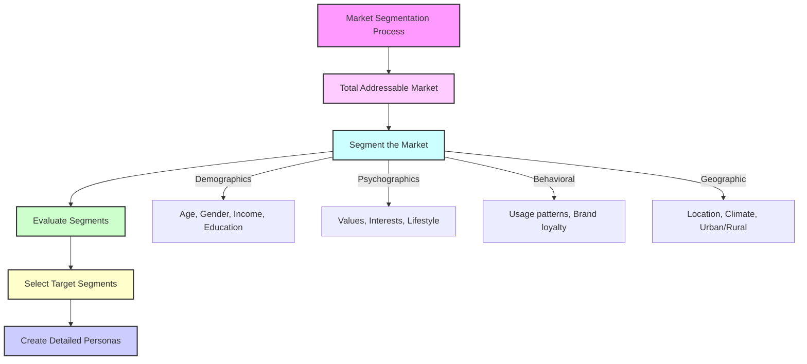
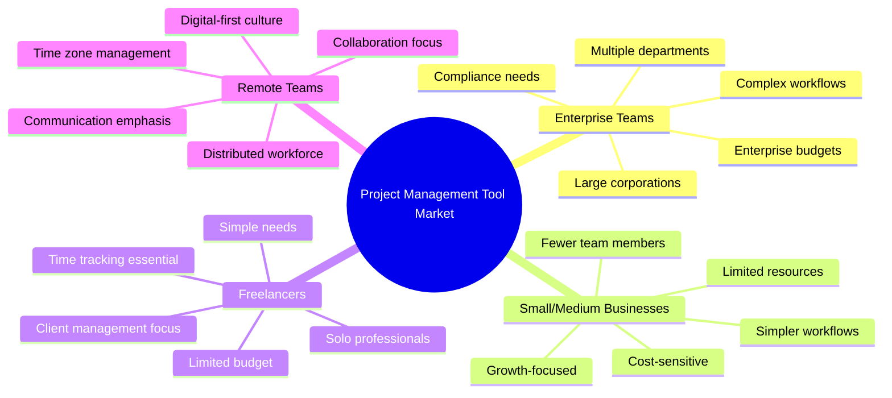
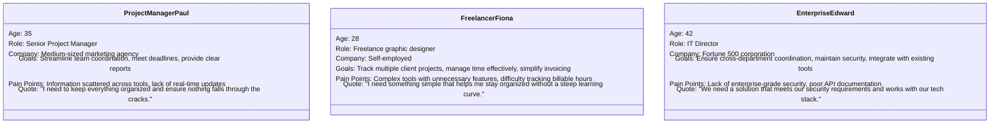
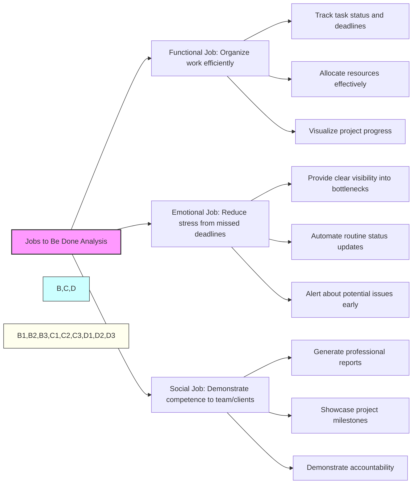
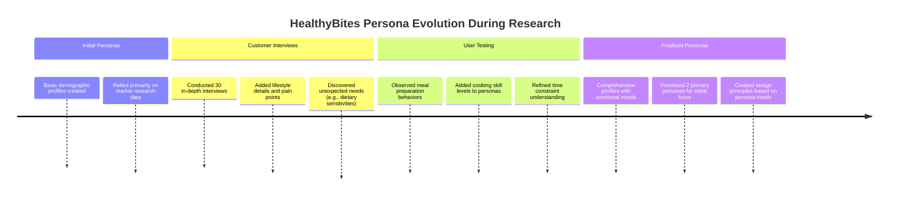
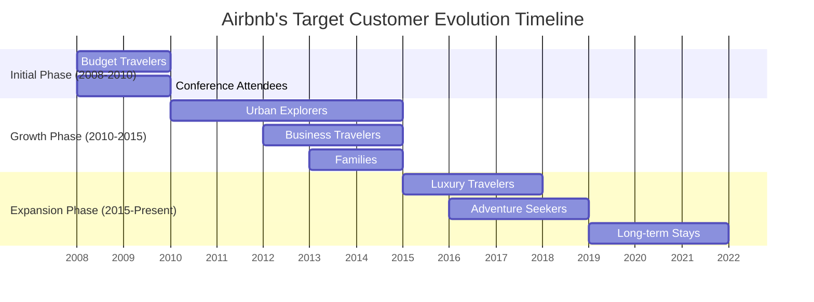

## **Chapter 3: Determine Your Target Customer**

In Chapter 3 of _Lean Product Playbook_, Dan Olsen emphasizes the foundational importance of **identifying and understanding your target customer** as the first critical step in the Lean Product Process. This step sets the stage for all subsequent product development activities by ensuring that the team is focused on creating value for a well-defined audience. Olsen outlines strategies and methodologies for accurately determining who the target customers are, understanding their needs, and segmenting the market effectively.

#### **Key Concepts Covered:**

1. **Customer Segmentation**: Dividing the broader market into smaller, more manageable groups based on shared characteristics.
2. **Personas Development**: Creating detailed profiles of hypothetical users that represent different segments of the target market.
3. **Jobs to Be Done (JTBD)**: Understanding the specific tasks or problems that customers aim to address with your product.
4. **Value Proposition Alignment**: Ensuring that the product's value proposition resonates with the identified target customers.

### **Key Takeaways**

1. **Start with the Customer**: Product development should always begin with a deep understanding of the customer, not the product idea. This ensures that the product addresses real needs and pain points.
2. **Effective Segmentation**: Properly segmenting the market allows for more precise targeting and better allocation of resources. Segmentation can be based on demographics, psychographics, behavior, or geographic factors.
3. **Develop Detailed Personas**: Personas help humanize target segments, making it easier for teams to empathize with users and design solutions tailored to their specific needs.
4. **Focus on Jobs to Be Done**: Understanding the jobs customers are trying to accomplish provides clarity on what features and functionalities will deliver the most value.
5. **Align Value Proposition with Customer Needs**: The product's value proposition should directly address the needs and desires of the target customer, ensuring a strong market fit.

### **Practical Applicability**

To effectively determine your target customer, apply the following steps and strategies outlined in Chapter 3:

#### **1. Conduct Market Segmentation**

**Example**: Suppose you're developing a new project management tool. Start by segmenting the market:

- **Demographics**: Age, gender, income level, education.
- **Firmographics**: Company size, industry, revenue.
- **Behavioral**: Usage rate, brand loyalty, feature preference.
- **Psychographics**: Attitudes, values, lifestyle.

**Implementation**:

- Use surveys and market research reports to gather data.
- Identify distinct segments that have unique needs or behaviors.

#### **2. Create Detailed Personas**

**Example**: For the project management tool, you might develop personas such as:

- **Project Manager Paul**:

  - **Age**: 35
  - **Company Size**: Medium (50-200 employees)
  - **Needs**: Streamlined task assignment, progress tracking, team collaboration.
  - **Pain Points**: Current tools are too fragmented, lack of real-time updates.
  - **Typical Day**: Starts with reviewing project timelines, conducts stand-up meetings, adjusts resource allocations, and responds to client inquiries about project status.
  - **Technology Usage**: Moderately tech-savvy, uses multiple tools daily, prefers desktop over mobile for work tasks.

- **Freelancer Fiona**:

  - **Age**: 28
  - **Profession**: Freelance graphic designer
  - **Needs**: Simple project tracking, client communication, invoice management.
  - **Pain Points**: Overly complex tools that are not tailored to solo professionals.
  - **Typical Day**: Juggles 3-4 client projects, tracks time spent on each task, communicates with clients about revisions, and sends invoices based on completed work.
  - **Technology Usage**: Tech-savvy, mobile-first user, relies heavily on cloud storage and digital communication.

- **Enterprise Edward**:
  - **Age**: 42
  - **Role**: IT Director at a large corporation
  - **Needs**: Enterprise-level security, advanced reporting, integration capabilities
  - **Pain Points**: Lack of granular permissions, insufficient audit logging
  - **Typical Day**: Oversees multiple departments' technology needs, ensures compliance with company policies, evaluates new tools for enterprise adoption.
  - **Technology Usage**: Security-focused, requires SSO compatibility, values stability over cutting-edge features.

**Implementation**:

- Conduct in-depth interviews with representatives from each segment.
- Document their goals, challenges, and preferences.
- Share personas across the team to create a common understanding of target users.

#### **3. Understand Jobs to Be Done (JTBD)**

**Example**: Using JTBD for the project management tool:

- **Primary Job**: Organize and manage multiple projects efficiently.
- **Secondary Jobs**: Communicate with team members, track project progress, generate reports for stakeholders.
- **Emotional Jobs**: Reduce stress related to project deadlines, feel confident about project status.
- **Social Jobs**: Appear organized and in control to team members and clients.

**Implementation**:

- Use the JTBD framework to map out what customers are trying to achieve.
- Prioritize jobs based on their importance and the level of satisfaction customers currently have.
- Connect specific product features to the jobs users need to complete.

#### **4. Align Your Value Proposition**

**Example**: For Project Manager Paul, the value proposition might be:

"**Our project management tool simplifies task assignment and provides real-time progress tracking, enabling you to manage your team more effectively and reduce project delays.**"

For Freelancer Fiona:

"**A streamlined project management solution designed specifically for solo professionals, helping you track client work, manage time, and simplify invoicing—all without the complexity of enterprise tools.**"

**Implementation**:

- Craft value propositions for each persona that directly address their specific needs and pain points.
- Ensure that marketing messages and product features reflect these value propositions.
- Test value propositions with representatives from each target segment to validate their appeal.

### **Case Study: Streamlining a Meal Kit Delivery Service**

**Background**:
HealthyBites, a meal kit delivery service, noticed stagnating growth and inconsistent customer retention rates. The company decided to revisit its target customer identification to realign its offerings.

**Step 1: Market Segmentation**
HealthyBites segmented its market based on:

- **Demographics**: Young professionals (25-35), families with children, seniors.
- **Behavioral**: Health-conscious individuals, busy lifestyles, culinary enthusiasts.
- **Geographic**: Urban areas with higher disposable incomes.

**Step 2: Creating Personas**

- **Young Professional Yara**:

  - **Age**: 30
  - **Occupation**: Marketing Manager
  - **Needs**: Quick, healthy meals with minimal preparation time.
  - **Pain Points**: Limited time for grocery shopping and cooking after work.
  - **Cooking Experience**: Basic cooking skills, prefers meals under 30 minutes
  - **Dietary Preferences**: Flexitarian, interested in plant-based options
  - **Shopping Habits**: Normally grabs takeout 3-4 times per week, grocery shops on weekends

- **Family-Focused Frank**:
  - **Age**: 40
  - **Occupation**: Software Engineer
  - **Needs**: Balanced meals that cater to both adults and children.
  - **Pain Points**: Managing diverse dietary preferences and ensuring meals are nutritious.
  - **Household**: Married with 2 children (ages 8 and 11)
  - **Cooking Experience**: Intermediate skills, can handle 45-minute recipes
  - **Dietary Preferences**: No dietary restrictions but concerned about nutrition for kids
  - **Shopping Habits**: Weekly big grocery shop, struggles with meal planning

**Step 3: Jobs to Be Done**

- **Yara's JTBD**: "I need to prepare healthy meals quickly after a long day at work so that I can maintain my diet without spending too much time cooking."
- **Frank's JTBD**: "I need to provide nutritious and varied meals for my family without the hassle of meal planning and grocery shopping."

**Step 4: Aligning Value Proposition**

- **For Yara**:
  - "HealthyBites delivers pre-portioned, nutritious meal kits that you can prepare in under 30 minutes, fitting seamlessly into your busy schedule."
- **For Frank**:
  - "HealthyBites offers family-friendly meal options with diverse flavors and nutritional balance, making dinner time enjoyable and stress-free for everyone."

**Implementation and Outcome**:

- **Personalized Marketing**: HealthyBites tailored its marketing campaigns to address the specific needs of Yara and Frank, using targeted messaging and channels.
- **Product Adjustments**: Introduced quick-prep meal options for young professionals and family-sized kits with customizable ingredients for families.
- **Result**: Within six months, HealthyBites saw a 25% increase in new subscriptions and a 15% boost in customer retention, driven by a clearer focus on target customer needs.

### **Insights and Best Practices**

1. **Start Broad, Then Narrow Down**: Begin with broad market research to understand the landscape, then narrow down to specific segments that align with your business strengths and opportunities.

2. **Use Multiple Data Sources**: Combine qualitative insights from interviews and surveys with quantitative data from market research to create a comprehensive view of your target customers.

3. **Iterate and Refine Personas**: Personas should evolve based on ongoing customer feedback and market changes. Regularly update them to reflect new insights.

4. **Prioritize High-Value Segments**: Focus on segments that offer the highest potential for growth and profitability, ensuring efficient use of resources.

5. **Empathy is Key**: Truly understanding and empathizing with your target customers' experiences and emotions leads to more effective product solutions.

### **Example: How Airbnb Refined Their Target Customer**

Airbnb's success can be attributed to their evolving and nuanced understanding of their target customers:

1. **Initial Focus (2008-2010)**:

   - **Target Segments**: Budget travelers and conference attendees in major cities
   - **Key Insight**: Identified an underserved need for affordable accommodations during high-demand events
   - **Persona Example**: "Conference Carl" - A 30-year-old tech professional who needs affordable accommodation during industry events when hotels are fully booked or overpriced

2. **Market Expansion (2010-2015)**:

   - **Target Segments**: Expanded to urban explorers seeking authentic local experiences
   - **Key Insight**: Travelers increasingly valued unique, local experiences over standardized hotel stays
   - **Persona Refinement**: Added "Experience-seeking Emma" - A 28-year-old professional who travels to immerse herself in local culture and seeks accommodations that provide authentic experiences

3. **Segment Diversification (2015-Present)**:

   - **Target Segments**: Luxury travelers, adventure seekers, families, and business travelers
   - **Key Insight**: Different segments had distinct needs that required tailored offerings
   - **Feature Development**: Created Airbnb Plus for luxury travelers, Airbnb for Work for business travelers, and Experiences for adventure seekers

4. **Pandemic Adaptation (2020-Present)**:
   - **Target Segments**: Remote workers, nearby escapees, and long-term stayers
   - **Key Insight**: Travel patterns fundamentally shifted, with more focus on remote work opportunities and longer stays
   - **Product Adjustments**: Enhanced long-term stay discounts, added WiFi speed information, and created a remote work category

**Critical Success Factors**:

- Continuous qualitative research with users to uncover emerging needs
- Willingness to expand beyond initial target market as the product matured
- Feature development specifically designed for each target persona
- Marketing strategies that spoke directly to the needs of each segment

This example demonstrates how target customer understanding should evolve as your product and market mature, and how deeply understanding customer segments can drive product development decisions.

### **Conclusion**

Chapter 3 of _Lean Product Playbook_ underscores that accurately determining your target customer is essential for successful product development. By employing strategies such as market segmentation, persona creation, and understanding jobs to be done, product teams can ensure that their offerings are precisely aligned with the needs and desires of their intended audience. This customer-centric approach not only enhances product relevance and user satisfaction but also drives better business outcomes through targeted and efficient product strategies.
