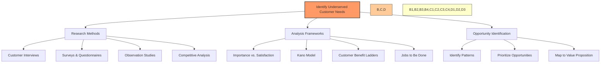
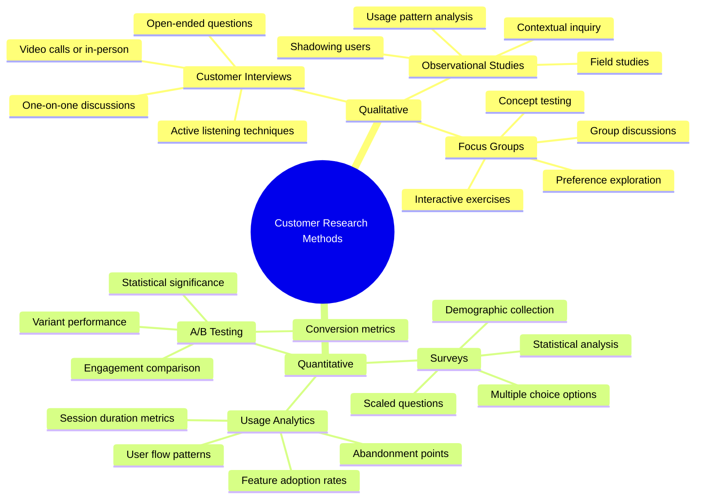
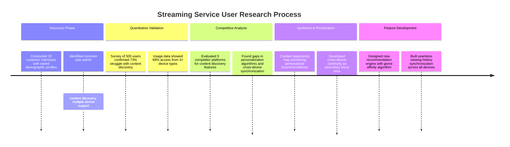
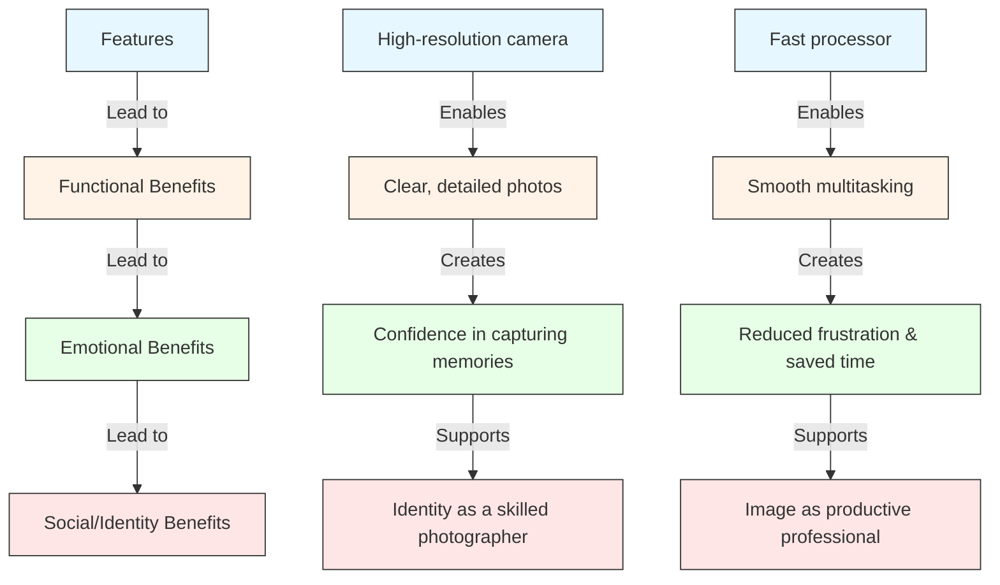
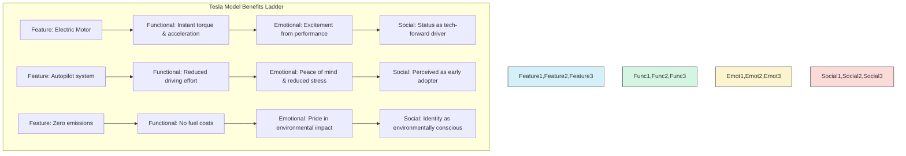
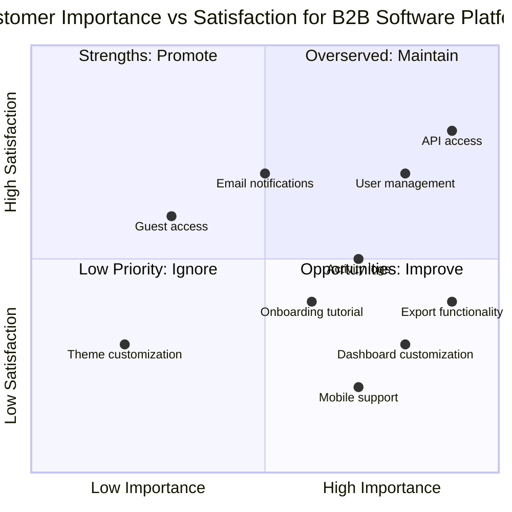
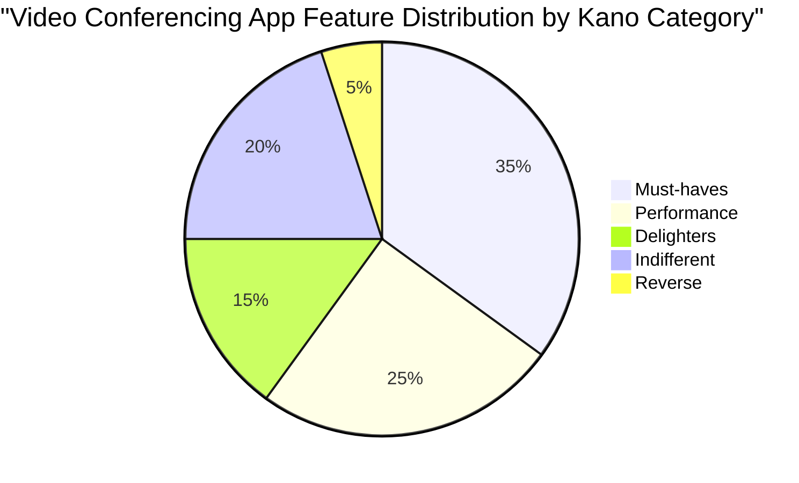
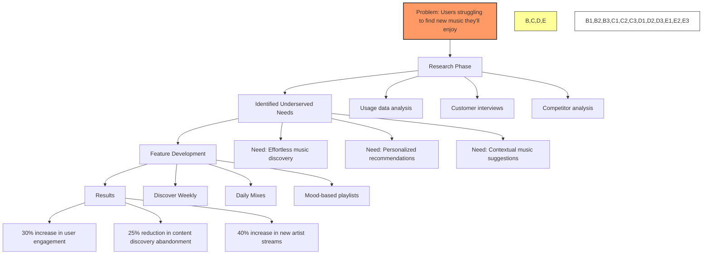

## **Chapter 4: Identify Underserved Customer Needs**

In Chapter 4 of _Lean Product Playbook_, Dan Olsen explores **Identifying Underserved Customer Needs**, the second critical step in the Lean Product Process. This chapter focuses on uncovering the gaps between what customers currently experience and what they desire, ensuring that product development efforts are directed toward addressing real and impactful needs. By identifying underserved needs, product teams can prioritize features and solutions that deliver maximum value and differentiate their offerings in the market.

---

## **1. Customer Needs Identification**

### **Understanding Customer Needs**

Identifying customer needs is the cornerstone of successful product development. These needs can be categorized into:

- **Articulated Needs**: These are needs that customers can explicitly express. For example, a customer might say, "I need a smartphone with a longer battery life."

- **Unarticulated Needs**: These are underlying needs that customers may not consciously recognize or articulate. For instance, a customer might desire a longer battery life without explicitly stating it, simply by expressing frustration with frequent recharging.

### **Methods for Identifying Needs**

#### **Customer Discovery Interviews**

Conducting effective customer discovery interviews is pivotal in uncovering both articulated and unarticulated needs. Here's how to approach them:

- **Preparation**:

  - **Define Objectives**: Clearly outline what you aim to learn from the interviews.
  - **Select Participants**: Choose a diverse group of target customers to gain varied perspectives.

- **Conducting the Interview**:

  - **Open-Ended Questions**: Encourage detailed responses (e.g., "Can you walk me through how you use [current solution] in your daily routine?").
  - **Avoid Leading Questions**: Ensure questions are neutral to prevent biasing responses.
  - **Active Listening**: Pay close attention to verbal and non-verbal cues to identify underlying needs.

- **Post-Interview Analysis**:
  - **Identify Patterns**: Look for recurring themes and pain points across interviews.
  - **Synthesize Insights**: Combine qualitative data to form a coherent understanding of customer needs.

#### **Additional Techniques**

- **Surveys and Questionnaires**: Quantitative methods to validate findings from interviews.
- **Observational Studies**: Watching customers interact with products in real-life settings to identify unnoticed needs.
- **Customer Feedback and Reviews**: Analyzing existing feedback to spot common issues and desires.

**Example: Streaming Service User Research**

A streaming service company wanted to improve user engagement. Through interviews, they discovered that users struggled to find content they would enjoy (an articulated need) and often watched across multiple devices but lost their place when switching (an unarticulated need they observed through usage patterns). These insights led to developing an advanced recommendation algorithm and cross-device synchronization feature, resulting in a 28% increase in average viewing time.

---

## **2. Customer Benefit Ladders**

### **What Are Customer Benefit Ladders?**

Customer Benefit Ladders are visual tools that map out the hierarchy of customer needs, from basic functionalities to higher-level emotional or social benefits. This framework ensures that your product addresses not just the surface-level requirements but also the deeper values and motivations of your customers.

### **Creating a Customer Benefit Ladder**

1. **Identify Functional Needs**:

   - **Definition**: The basic tasks or functions that a product must perform.
   - **Example**: A messaging app should allow users to send and receive messages.

2. **Ascend to Emotional Benefits**:

   - **Definition**: The emotional responses or feelings that customers associate with the product.
   - **Example**: The messaging app makes users feel connected and secure.

3. **Reach Social or Self-Expressive Benefits**:
   - **Definition**: How the product enables customers to express their identity or social status.
   - **Example**: The app allows users to showcase their personality through customizable themes and stickers.

### **Benefits of Using Benefit Ladders**

- **Comprehensive Understanding**: Ensures that all levels of customer needs are considered.
- **Prioritization**: Helps prioritize features that deliver the most significant impact on customer satisfaction.
- **Alignment with Values**: Aligns product development with the core values and motivations of customers.

**Example: Electric Vehicle Benefit Ladder**

Tesla effectively addresses multiple levels of customer needs:

- **Functional Level**: Practical benefits like performance and cost savings
- **Emotional Level**: Pride, excitement, peace of mind
- **Social/Identity Level**: Environmental consciousness, tech-savvy image

By understanding this hierarchy, Tesla's marketing emphasizes not just the technical specifications but the emotional and identity benefits of owning their vehicles, creating stronger customer connections.

---

## **3. Importance vs. Satisfaction Framework**

### **Overview**

The Importance vs. Satisfaction Framework is a strategic tool used to evaluate and prioritize customer needs based on two dimensions:

- **Importance**: How critical a particular need is to the customer.
- **Satisfaction**: How well current solutions are addressing that need.

### **Steps to Implement the Framework**

1. **List Customer Needs**: Based on insights from discovery interviews and other research methods.

2. **Assess Importance**:

   - **Survey Customers**: Ask customers to rate the importance of each need.
   - **Scale Rating**: Use a consistent scale (e.g., 1 to 5) to quantify importance.

3. **Evaluate Satisfaction**:

   - **Current Solutions**: Determine how satisfied customers are with existing solutions addressing each need.
   - **Scale Rating**: Use the same scale as importance for consistency.

4. **Plot on the Framework**:
   - **High Importance, Low Satisfaction**: High-priority areas with significant opportunities for improvement.
   - **High Importance, High Satisfaction**: Maintain current solutions, ensuring continued satisfaction.
   - **Low Importance, Low Satisfaction**: Low-priority areas with minimal impact.
   - **Low Importance, High Satisfaction**: Potentially eliminate or deprioritize, as they may not significantly affect customer satisfaction.

### Importance x Satisfaction Matrix

The **Satisfaction x Importance Matrix** is a powerful tool introduced in _The Lean Product Playbook_ by Dan Olsen. It is used to evaluate and prioritize product features based on two key dimensions: **customer satisfaction** and **importance**. This matrix helps product teams make data-driven decisions on where to focus their efforts to deliver the most value to customers.

---

### Understanding the Matrix

The matrix is a two-dimensional grid where:

1. **X-axis (Importance)**: Represents how important a particular feature is to customers. Features to the right are more critical to users, while those to the left are less critical.
2. **Y-axis (Satisfaction)**: Represents how satisfied customers are with the current implementation of the feature. Features higher up on the axis have high customer satisfaction, while those lower down are areas of dissatisfaction.

The intersection of these two axes divides the matrix into four quadrants:

---

### The Four Quadrants

1. **High Importance, Low Satisfaction (Upper Left Quadrant)**

   - **Interpretation**: These are critical areas where customers are dissatisfied.
   - **Action**: Prioritize these features for improvement. They represent the biggest opportunities for delivering customer value.
   - **Example**:  
     Suppose you're building a fitness app, and users rate the **calorie tracking feature** as very important but are dissatisfied with how it tracks macros. This should be a top focus area.

2. **High Importance, High Satisfaction (Upper Right Quadrant)**

   - **Interpretation**: These are features that are important and already meet or exceed customer expectations.
   - **Action**: Maintain the quality of these features but do not allocate significant resources unless necessary.
   - **Example**: If the **workout scheduling feature** in your app is both highly rated and important, you'd keep monitoring it but not overhaul it.

3. **Low Importance, Low Satisfaction (Lower Left Quadrant)**

   - **Interpretation**: These features are neither important to customers nor satisfactory.
   - **Action**: Deprioritize or eliminate these features. They add little value.
   - **Example**: A **step tracker widget** that is clunky and deemed unimportant by most users would fit here.

4. **Low Importance, High Satisfaction (Lower Right Quadrant)**
   - **Interpretation**: These are features that delight users but are not particularly critical.
   - **Action**: Treat these as "nice-to-have" features. Invest only if you have extra resources.
   - **Example**: A **social sharing feature** in your app might delight a small niche but is not a priority for most users.

**Example: B2B Software Platform Feature Analysis**

**Actions Based on Analysis:**

1. **High Priority Improvements**:

   - Dashboard customization (most critical opportunity)
   - Export functionality
   - Mobile support

2. **Strengths to Promote in Marketing**:

   - API access
   - User management

3. **Low Investment Areas**:
   - Theme customization (low importance/satisfaction)
   - Guest access (low importance but satisfactory)

By conducting this analysis, the product team identified that improving dashboard customization would deliver the highest customer value and prioritized development resources accordingly.

---

### Steps to Build and Use the Matrix

#### 1. **Gather Data**

- Use customer surveys, interviews, or feedback tools.
- Ask two key questions for each feature:
  1.  **How important is this feature to you?** (Rate on a scale of 1–10)
  2.  **How satisfied are you with the current implementation?** (Rate on a scale of 1–10)

#### 2. **Plot Features on the Matrix**

- For each feature, calculate the average **importance** and **satisfaction** scores.
- Place the feature on the matrix based on these scores.

#### 3. **Analyze Results**

- Identify which features fall into each quadrant.
- Focus on the **high importance, low satisfaction** quadrant to prioritize your roadmap.

#### 4. **Set Priorities**

- Allocate resources to improve critical pain points.
- Consider trade-offs for low-importance features.

---

### Example: Food Delivery App

Let's imagine you're analyzing features for a food delivery app. Here's how some features might fall into the matrix:

| Feature                  | Importance (Avg. Score) | Satisfaction (Avg. Score) | Quadrant                           |
| ------------------------ | ----------------------- | ------------------------- | ---------------------------------- |
| Real-time order tracking | 9                       | 4                         | High Importance, Low Satisfaction  |
| Payment options          | 8                       | 8                         | High Importance, High Satisfaction |
| Loyalty rewards program  | 5                       | 3                         | Low Importance, Low Satisfaction   |
| Custom food preferences  | 6                       | 7                         | Low Importance, High Satisfaction  |

#### Interpretation:

- **Real-time order tracking**: A high-priority fix. Users rely on it but are dissatisfied with the current implementation (e.g., delays in updates).
- **Payment options**: Continue supporting this feature without major investments. It's performing well.
- **Loyalty rewards program**: Consider removing or deprioritizing this unless you see a strategic opportunity.
- **Custom food preferences**: Keep this as an enhancement but avoid over-investing.

---

### Strategic Implications

1. **Customer-Centric Roadmap**:  
   The matrix ensures that your product roadmap aligns with customer priorities.

2. **Resource Allocation**:  
   It helps teams avoid wasting time on features that are unimportant or already meeting expectations.

3. **Continuous Feedback**:  
   Regularly update the matrix to reflect evolving customer needs and satisfaction levels.

4. **Team Alignment**:  
   Visualizing the matrix fosters clarity and consensus among stakeholders about where to focus efforts.

---

### Common Mistakes to Avoid

1. **Ignoring Data**:  
   Decisions should be backed by actual user feedback, not assumptions.

2. **Overloading Features**:  
   Adding too many "nice-to-have" features can dilute focus and clutter the product.

3. **Focusing Only on Problems**:  
   While addressing dissatisfaction is critical, don't forget to maintain features that already delight customers.

---

### **Application Example**

Imagine developing a project management tool:

- **Need A**: Real-time collaboration (High Importance, Low Satisfaction)
- **Need B**: Customizable dashboards (Medium Importance, High Satisfaction)
- **Need C**: Integration with other tools (High Importance, High Satisfaction)
- **Need D**: Advanced analytics (Low Importance, Low Satisfaction)

In this scenario, **Need A** becomes a top priority for development, as improving real-time collaboration will address a highly important and currently underserved area.

---

## **4. Kano Model**

The Kano Model, developed by Professor Noriaki Kano in the 1980s, is a framework for understanding how different product or service features impact customer satisfaction. It categorizes features into five distinct types, each influencing satisfaction in unique ways.

```mermaid
graph TD
    A[Kano Model] --> B[Must-have Features]
    A --> C[Performance Features]
    A --> D[Delighter Features]
    A --> E[Indifferent Features]
    A --> F[Reverse Features]

    B --> B1["Example: Working brakes in a car"]
    B --> B2["Impact: Absence causes dissatisfaction"]

    C --> C1["Example: Battery life in phone"]
    C --> C2["Impact: More is better, linear satisfaction"]

    D --> D1["Example: Unexpected free upgrade"]
    D --> D2["Impact: Creates delight, absence not noticed"]

    E --> E1["Example: Brand of internal components"]
    E --> E2["Impact: Users don't care either way"]

    F --> F1["Example: Excessive automation"]
    F --> F2["Impact: Presence causes dissatisfaction"]

    style A fill:#f9f,stroke:#333,stroke-width:2px
    style B fill:#fcc,stroke:#333,stroke-width:1px
    style C fill:#cfc,stroke:#333,stroke-width:1px
    style D fill:#ccf,stroke:#333,stroke-width:1px
    style E fill:#ccc,stroke:#333,stroke-width:1px
    style F fill:#ffc,stroke:#333,stroke-width:1px
```

**1. Must-Have (Basic) Requirements**

These are fundamental features that customers expect. Their presence doesn't increase satisfaction, but their absence leads to dissatisfaction.

_Examples:_

- A hotel room having clean bedding and a functional bathroom.
- A smartphone's ability to make calls.

**2. One-Dimensional (Performance) Requirements**

These features have a linear relationship with customer satisfaction—the better they are implemented, the higher the satisfaction, and vice versa.

_Examples:_

- The fuel efficiency of a car.
- The speed of internet service.

**3. Attractive (Excitement) Requirements**

These are unexpected features that delight customers when present but don't cause dissatisfaction when absent.

_Examples:_

- A hotel offering complimentary breakfast.
- A smartphone with a built-in projector.

**4. Indifferent Requirements**

Features that neither significantly affect satisfaction nor dissatisfaction, regardless of their presence.

_Examples:_

- The color of internal wiring in a device.
- The design of a product's packaging insert.

**5. Reverse Requirements**

Features that some customers may dislike; their presence can lead to dissatisfaction for certain segments.

_Examples:_

- A software application with excessive automation that reduces user control.
- A car with overly complex dashboard controls.

**Practical Application of the Kano Model**

To apply the Kano Model, companies conduct customer surveys asking two questions per feature:

1. **Functional Question:** "How would you feel if this feature were present?"
2. **Dysfunctional Question:** "How would you feel if this feature were absent?"

Customers respond using a scale ranging from "I like it" to "I dislike it." Analyzing these responses helps categorize each feature, guiding prioritization in product development to enhance customer satisfaction effectively.

By understanding and applying the Kano Model, businesses can strategically focus on features that meet basic expectations, improve performance, and provide delightful surprises, thereby optimizing customer satisfaction and loyalty.

**Example: Video Conferencing App Feature Classification**

**Must-have Features:**

- Stable video transmission
- Clear audio quality
- Basic screen sharing
- Meeting scheduling

**Performance Features:**

- Video resolution quality
- Number of simultaneous participants
- Recording quality
- Background noise cancellation

**Delighter Features:**

- AI-powered meeting transcription
- Virtual backgrounds
- Gesture recognition for reactions
- Automatic meeting summarization

**Indifferent Features:**

- Custom meeting URLs
- Company-branded waiting rooms
- Advanced polling features
- Detailed usage analytics

**Reverse Features:**

- Automatic camera activation when joining
- Mandatory account creation for participants

The product team used this classification to ensure all must-have features were perfect before investing in performance features. They strategically added delighters to differentiate from competitors, while avoiding reverse features that would annoy users.

---

## **Practical Application: Step-by-Step Guide**

### **1. Conduct Customer Discovery Interviews**

**Objective**: Uncover both expressed and latent customer needs.

**Steps**:

- **Define Target Audience**: Clearly identify who your customers are.
- **Develop an Interview Guide**: Prepare questions that explore both current experiences and desired improvements.
- **Schedule and Conduct Interviews**: Engage in meaningful conversations, ensuring a comfortable environment for honest feedback.
- **Analyze Data**: Look for recurring themes, pain points, and desires.

**Tips**:

- **Stay Neutral**: Avoid influencing responses with your own biases.
- **Probe Deeply**: Ask follow-up questions to uncover underlying motivations.
- **Record and Transcribe**: Ensure accurate data collection for thorough analysis.

### **2. Utilize the Importance vs. Satisfaction Framework**

**Objective**: Prioritize customer needs based on their significance and current fulfillment.

**Steps**:

- **Compile a List of Needs**: From discovery interviews and other research.
- **Survey Customers**: Collect ratings for both importance and satisfaction for each need.
- **Plot Results**: Create a matrix to visualize the positioning of each need.
- **Identify Priorities**: Focus on needs that are highly important but have low satisfaction.

**Tips**:

- **Ensure Representative Sampling**: Gather feedback from a diverse customer base to avoid skewed results.
- **Regular Updates**: Reassess periodically as customer preferences and market conditions evolve.
- **Balance Short-Term and Long-Term Goals**: Address immediate high-impact needs while planning for future enhancements.

### **3. Apply the Kano Model**

**Objective**: Classify features to balance essential functions with innovative enhancements.

**Steps**:

- **List Potential Features**: Based on customer needs and competitive analysis.
- **Categorize Features**: Use surveys or interviews to determine the Kano category for each feature.
- **Prioritize Development**:
  - **Address All Basic Needs**: Ensure no fundamental requirement is overlooked.
  - **Enhance Performance Needs**: Optimize these features to improve user satisfaction.
  - **Innovate with Delighters**: Introduce unique features that set your product apart.

**Tips**:

- **Iterative Classification**: Re-evaluate feature categories as you gather more customer feedback.
- **Cross-Functional Collaboration**: Involve different teams (e.g., design, engineering, marketing) in the classification process to ensure comprehensive perspectives.
- **Monitor Competitors**: Stay aware of industry trends to adjust delighters accordingly.

### Kano model example - IPhone

---

## **Benefits of Systematic Identification and Prioritization**

By systematically identifying and prioritizing underserved customer needs using frameworks like Customer Benefit Ladders, Importance vs. Satisfaction, and the Kano Model, product teams can achieve the following:

- **Enhanced Product-Market Fit**: Ensures that the product closely aligns with what customers truly need and value.
- **Efficient Resource Allocation**: Focuses development efforts on high-impact areas, optimizing time and budget.
- **Increased Customer Satisfaction**: Delivers solutions that address both essential and unexpected customer desires, fostering loyalty.
- **Competitive Advantage**: Innovates beyond basic requirements, differentiating the product in the market.

## **Real-World Example: Spotify's Discovery Features**

**Process:**

1. **Research**: Spotify identified through usage data and interviews that users were spending significant time searching for new music but often abandoning the process
2. **Frameworks Applied**:

   - **Importance vs. Satisfaction**: Music discovery rated high importance but low satisfaction
   - **Kano Model**: Personalized recommendations identified as a potential delighter
   - **Benefit Ladder**: From functional benefit (finding new music) to emotional benefit (feeling culturally connected)

3. **Feature Development**:

   - Created Discover Weekly - a personalized playlist refreshed every Monday
   - Developed Daily Mixes for different genre preferences
   - Introduced contextual playlists for different moods and activities

4. **Results**:

   - Features transformed from delighters to performance features as users came to expect them
   - Significantly improved retention metrics
   - Created strong competitive differentiation against other streaming services

5. **Continuous Iteration**:
   - Regular refinement of recommendation algorithms based on user feedback
   - Expansion to podcast recommendations as listening habits evolved

This example demonstrates how systematic identification of underserved needs led to breakthrough features that defined Spotify's market position and created enduring user value.

---

## **Common Pitfalls to Avoid**

1. **Assuming Instead of Listening**: Relying on assumptions about customer needs without proper validation through research.
2. **Overcomplicating Frameworks**: Using too many frameworks simultaneously, leading to confusion and diluted focus.
3. **Ignoring Unarticulated Needs**: Failing to delve deeper into underlying motivations and desires of customers.
4. **Lack of Iteration**: Not revisiting and updating the understanding of customer needs as the market evolves.
5. **Bias in Data Collection**: Allowing personal biases to influence the interpretation of customer feedback.

---

## **Conclusion**

Chapter 4 of _The Lean Product Playbook_ provides a robust framework for identifying and prioritizing customer needs, a vital step in achieving product-market fit. By leveraging customer discovery interviews, Customer Benefit Ladders, the Importance vs. Satisfaction Framework, and the Kano Model, product teams can gain a deep and actionable understanding of what their customers truly need and desire. This systematic approach not only enhances customer satisfaction but also ensures that development efforts are strategically aligned with market opportunities, paving the way for successful and sustainable product offerings.
