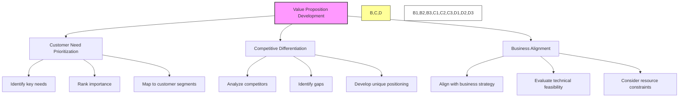
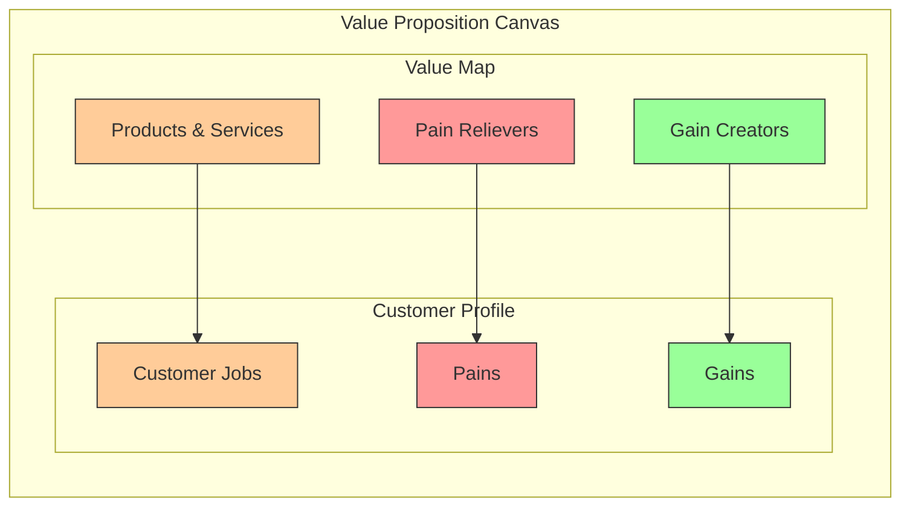
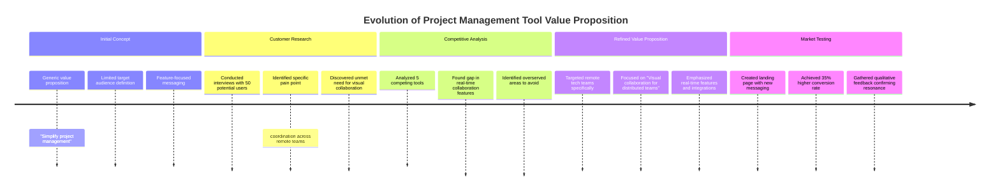
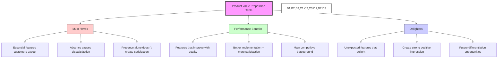
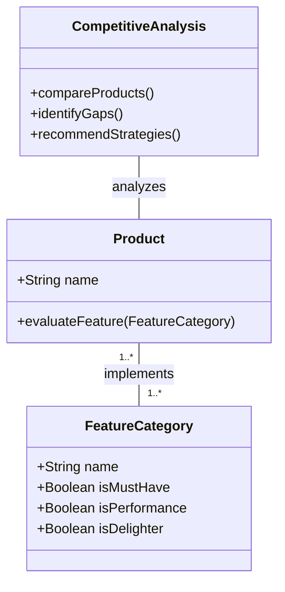

### Chapter 5 Crafting a Compelling Value Proposition

In Chapter 5 of _The Lean Product Playbook_, Dan Olsen delves into the pivotal importance of a well-defined value proposition as the cornerstone for achieving product-market fit. Olsen provides a comprehensive framework for product teams to identify and prioritize customer needs, differentiate their offerings from competitors, and ensure alignment with overarching business goals. This chapter not only outlines theoretical concepts but also equips readers with practical tools and actionable strategies to create value propositions that resonate deeply with target audiences.



#### **Key Concepts and Insights**

1. **Prioritizing Customer Needs**

   - **Insight:** Not all identified customer needs carry equal weight. Prioritizing ensures that product development focuses on addressing the most critical pain points, thereby maximizing value delivery.
   - **Deep Dive:** Olsen introduces techniques such as the Kano Model and impact-effort matrices to help teams evaluate and rank customer needs based on factors like customer satisfaction potential and implementation feasibility.

2. **Crafting the Value Proposition**

   - **Insight:** A compelling value proposition succinctly communicates how a product uniquely solves customer problems or enhances their situation better than alternatives.
   - **Deep Dive:** The chapter emphasizes clarity and specificity, urging teams to avoid vague statements. Olsen suggests focusing on tangible benefits and quantifiable outcomes that matter most to customers.

3. **Differentiation from Competitors**

   - **Insight:** Understanding the competitive landscape is crucial for identifying unique selling points that set a product apart.
   - **Deep Dive:** Olsen advocates for a thorough competitive analysis, including SWOT (Strengths, Weaknesses, Opportunities, Threats) assessments, to uncover gaps in the market and areas where the product can excel.

4. **Alignment with Business Goals**
   - **Insight:** A value proposition must not only appeal to customers but also align with the company's strategic objectives and operational capabilities.
   - **Deep Dive:** This alignment ensures sustainable growth and coherence across product development, marketing, and sales efforts. Olsen recommends regular cross-functional meetings to maintain this alignment.

#### **Value Proposition Canvas**

The Value Proposition Canvas is a powerful tool for aligning your product offerings with customer needs. It consists of two main components: the Customer Profile and the Value Map.



**Customer Profile:**

- **Customer Jobs:** What tasks are customers trying to complete? What problems are they trying to solve?
- **Pains:** What frustrations, obstacles, or risks do customers experience when performing these jobs?
- **Gains:** What benefits or positive outcomes do customers desire?

**Value Map:**

- **Products & Services:** What specific offerings help customers complete their jobs?
- **Pain Relievers:** How do your offerings address specific customer pains?
- **Gain Creators:** How do your offerings create specific customer gains?

The goal is to achieve a strong fit between what you offer (Value Map) and what customers need (Customer Profile).

#### **Practical Examples**

1. **Apple's iPhone**

   ```mermaid
   mindmap
       root((iPhone Value Proposition))
           User Experience
               Intuitive interface
               Seamless ecosystem integration
               Consistent performance
           Design & Quality
               Premium materials
               Cutting-edge aesthetics
               Durability
           Innovation
               Advanced camera systems
               Biometric security
               Computational photography
           Ecosystem
               iCloud integration
               App Store quality control
               Seamless device synchronization
   ```

   - **Value Proposition:** Seamless user experience, cutting-edge design, and a robust ecosystem.
   - **Differentiation:** Superior build quality and integration with other Apple products create a cohesive and exclusive user environment.
   - **Key Insight:** Apple focuses less on technical specifications and more on the overall experience and ecosystem benefits.

2. **Slack**

   ```mermaid
   classDiagram
       class SlackValueProposition {
           Core Benefit: Streamlined team communication
           Target Customer: Collaborative teams across industries
           Key Differentiators: Hub for team collaboration
           Primary Value: Reduced email, centralized communication
           Secondary Value: Extensive app integrations
       }

       class CompetitorEmail {
           Core Benefit: Formal communication
           Target Customer: All business users
           Key Differentiators: Universal adoption
           Primary Value: Official documentation
           Secondary Value: Asynchronous communication
       }

       class CompetitorTeams {
           Core Benefit: Microsoft ecosystem integration
           Target Customer: Enterprise Microsoft users
           Key Differentiators: Office 365 integration
           Primary Value: Familiar interface for Microsoft users
           Secondary Value: Video conferencing
       }

       SlackValueProposition -- CompetitorEmail: Differentiates from
       SlackValueProposition -- CompetitorTeams: Competes with
   ```

   - **Value Proposition:** Streamlined team communication and enhanced productivity through integrations with various tools.
   - **Differentiation:** Its role as a central hub for collaboration differentiates Slack from traditional communication platforms by offering extensive customization and integration capabilities.
   - **Key Insight:** Slack successfully positioned itself as an email replacement, addressing the pain point of cluttered inboxes and fragmented team communications.

3. **Tesla**
   - **Value Proposition:** Innovative electric vehicles that combine performance, sustainability, and advanced technology.
   - **Differentiation:** Pioneering autonomous driving features and a strong brand association with sustainability set Tesla apart in the automotive industry.
   - **Key Insight:** Tesla positioned itself not just as a car manufacturer but as a technology company, appealing to environmentally conscious and tech-savvy consumers.

#### **Actionable Steps and Strategies**

1. **Conduct Comprehensive Customer Research**

   ```mermaid
   flowchart TD
       A[Customer Research Process] --> B[Define Research Objectives]
       B --> C[Select Research Methods]
       C --> D[Conduct Research]
       D --> E[Analyze Findings]
       E --> F[Prioritize Insights]
       F --> G[Create Value Proposition]

       C --> C1[In-depth Interviews]
       C --> C2[Surveys]
       C --> C3[Focus Groups]
       C --> C4[User Observation]

       style A fill:#f96,stroke:#333,stroke-width:2px
       style B,C,D,E,F,G fill:#ffc,stroke:#333,stroke-width:1px
       style C1,C2,C3,C4 fill:#fff,stroke:#333,stroke-width:1px
   ```

   - **Strategy:** Utilize a mix of qualitative and quantitative methods, such as in-depth interviews, surveys, focus groups, and user observations, to gather rich insights into customer pain points and preferences.
   - **Example:** A SaaS company might conduct user interviews to understand the specific challenges their customers face with current project management tools, uncovering unmet needs that can be addressed in their product.
   - **Key Questions to Ask:**
     - "What is the hardest part of your current workflow?"
     - "If you could wave a magic wand and change one thing about your current solution, what would it be?"
     - "What would make you switch from your current solution to a new one?"

2. **Utilize the Value Proposition Canvas**

   - **Strategy:** Leverage this tool to map out the relationship between customer segments and your product's value proposition, ensuring every aspect of the product addresses specific customer needs.
   - **Example:** A health and fitness app could use the canvas to align features like personalized workout plans and nutrition tracking with user desires for convenience and tangible health improvements.
   - **Implementation Steps:**
     1. Identify customer jobs, pains, and gains for each segment
     2. Map your products/services to these elements
     3. Refine until you achieve a strong fit

3. **Differentiate Through Unique Features and Benefits**

   - **Strategy:** Identify and develop features that are not only unique but also highly valued by customers, setting your product apart from competitors.
   - **Example:** An e-commerce platform might offer an AI-driven personal shopping assistant, providing a personalized shopping experience that competitors lack.
   - **Differentiation Framework:**
     - **Better:** Improving on existing solutions (faster, cheaper, easier)
     - **Different:** Offering an alternative approach to solving the problem
     - **New:** Addressing previously unsolved problems

4. **Align Value Proposition with Business Objectives**

   - **Strategy:** Ensure that the value proposition supports the company's long-term goals, such as market expansion, revenue growth, or brand positioning.
   - **Example:** A startup focused on sustainable products ensures that its value proposition highlights eco-friendly materials and ethical production processes, aligning with its mission to promote sustainability.
   - **Alignment Check Questions:**
     - Does this value proposition support our business model?
     - Can we deliver on this promise with our current resources?
     - Does this position us favorably against competitors?

5. **Iterate Based on Continuous Feedback**
   - **Strategy:** Implement a feedback loop where customer input is regularly collected and analyzed to refine and enhance the value proposition.
   - **Example:** A mobile app developer releases beta versions to a select group of users, gathers feedback on the app's usability and features, and iteratively improves the product before the full launch.
   - **Feedback Sources:**
     - User testing sessions
     - Customer support interactions
     - Product usage analytics
     - Market response data

#### **Example: Evolving a Value Proposition for a Project Management Tool**



**Initial Value Proposition:**
"A project management tool that simplifies task tracking and team coordination."

**Problems with Initial Approach:**

- Too generic and applies to all project management tools
- Focused on features rather than outcomes
- No clear differentiation from competitors
- Not targeted to specific customer segments

**Refined Value Proposition:**
"The visual collaboration platform that helps remote technical teams coordinate complex projects in real-time, reducing miscommunication by 50% and accelerating delivery timelines."

**Improvements:**

- Targets a specific segment (remote technical teams)
- Highlights unique differentiator (visual collaboration)
- Focuses on concrete benefits (reduced miscommunication, faster delivery)
- Quantifies value (50% reduction)

**Results:**

- 35% increase in landing page conversion rates
- Clearer product development roadmap focused on delivering the promised value
- More effective sales conversations with qualified prospects
- Stronger alignment between marketing messaging and actual product capabilities

#### **Key Takeaways**

- **Customer-Centric Focus:** Prioritizing and deeply understanding customer needs is essential for creating a value proposition that truly resonates.
- **Clear Differentiation:** Effectively distinguishing your product from competitors through unique features and benefits is crucial for standing out in the market.
- **Strategic Alignment:** Ensuring that the value proposition aligns with business goals fosters cohesive and sustainable growth.
- **Continuous Improvement:** Regularly refining the value proposition based on customer feedback ensures it remains relevant and compelling over time.

#### **Enhanced Insights**

- **Holistic Approach:** Combining customer insights with competitive analysis and business objectives leads to a more robust and effective value proposition.
- **Scalability Considerations:** As products grow, the value proposition should evolve to address new market segments and emerging customer needs without losing its core essence.
- **Emotional Connection:** Beyond functional benefits, building an emotional connection through the value proposition can significantly enhance customer loyalty and brand advocacy.

By meticulously defining, validating, and continuously refining the value proposition, product teams can create offerings that not only meet but exceed customer expectations, ensuring a strong foothold in the competitive marketplace.

### Value Product Value Proposition Table (a.k.a Feature Matrix)

Product Value Proposition Table is a strategic tool designed to evaluate and compare how well your product and its competitors meet customer needs. This table categorizes features into three groups: Must-Haves, Performance Benefits, and Delighters.



TLDR: You'll basically compete on performance benefits and delighters, because must-haves are just the basics your product needs to have to begin with.

**1. Must-Haves:** These are essential features that customers expect as standard. Their absence can lead to customer dissatisfaction, but their presence alone doesn't guarantee satisfaction.

**2. Performance Benefits:** These features enhance customer satisfaction proportionally—the better they are implemented, the more they satisfy the customer. They serve as key differentiators among competing products.

**3. Delighters:** These are unexpected features that pleasantly surprise customers, providing a competitive edge and fostering customer loyalty.

By constructing a Product Value Proposition Table, you can systematically assess how your product stacks up against competitors in these categories, guiding strategic decisions to enhance your product's market position.

**Example: Video Conferencing Software Competitive Analysis**



| Feature Category          | Your Product | Competitor A | Competitor B | Classification |
| ------------------------- | ------------ | ------------ | ------------ | -------------- |
| **Video Quality**         | HD           | HD           | 4K           | Performance    |
| **Max Participants**      | 100          | 50           | 250          | Performance    |
| **Screen Sharing**        | Yes          | Yes          | Yes          | Must-Have      |
| **Chat Function**         | Yes          | Yes          | Yes          | Must-Have      |
| **Background Blur**       | Yes          | No           | Yes          | Performance    |
| **Virtual Backgrounds**   | Yes          | No           | Limited      | Performance    |
| **Meeting Transcription** | Yes          | No           | No           | Delighter      |
| **Gesture Recognition**   | Yes          | No           | No           | Delighter      |
| **Breakout Rooms**        | No           | Yes          | Yes          | Performance    |
| **Live Translation**      | Yes          | No           | No           | Delighter      |

**Strategic Insights from this Analysis:**

1. **Must-Have Coverage**: All three products satisfy the basic requirements (screen sharing, chat)
2. **Performance Differentiators**:
   - Competitor B leads in raw capacity (participants, video quality)
   - Your product offers better customization features
3. **Delighter Advantage**: Your product has unique AI-powered features (transcription, translation, gestures) that can be highlighted in marketing
4. **Improvement Opportunity**: Adding breakout rooms would close a competitive gap

This structured approach helps in identifying areas where your product can improve to better meet customer expectations and outperform competitors.

### Crafting a Value Proposition Statement

A well-structured value proposition statement typically follows this formula:

```mermaid
graph LR
    A["For (target customer)"] --> B["who (customer need/problem)"]
    B --> C["our product is a (product category)"]
    C --> D["that (key benefit/solution)"]
    D --> E["unlike (competitors/alternatives)"]
    E --> F["we (key differentiator)"]

    style A fill:#f9f,stroke:#333,stroke-width:1px
    style B fill:#fcf,stroke:#333,stroke-width:1px
    style C fill:#cff,stroke:#333,stroke-width:1px
    style D fill:#cfc,stroke:#333,stroke-width:1px
    style E fill:#ffc,stroke:#333,stroke-width:1px
    style F fill:#ccf,stroke:#333,stroke-width:1px
```



**Examples of Strong Value Propositions:**

1. **Stripe:** "Web and mobile payments, built for developers. Stripe is a suite of payment APIs that powers commerce for online businesses of all sizes."

2. **Slack:** "Slack makes work life simpler, more pleasant and more productive. It's a collaboration hub that brings the right people, information and tools together to get work done."

3. **Shopify:** "Sell online, in-person, and everywhere in between. Shopify gives you all the tools you need to start, run, and grow your business."

4. **Zoom:** "Flawless video. Clear audio. Instant sharing. Zoom brings teams together in a frictionless environment to get more done."

5. **HubSpot CRM:** "Everything you need to organize, track, and build better relationships with leads and customers. Yes, it's 100% free. Forever."

**Exercise: Value Proposition Development Framework**

For your own product, answer these questions:

1. Who is your specific target customer?
2. What specific problem does your product solve?
3. What category does your product belong to?
4. What are the key benefits your product delivers?
5. Who are your main competitors?
6. How does your product differ from competitors?

Combine your answers into a clear, concise statement that communicates your unique value.
