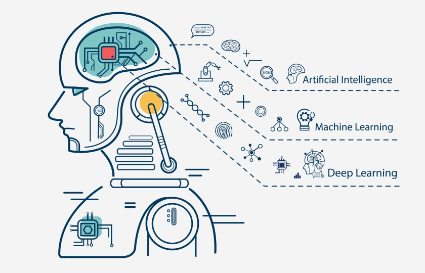

# Introduction to Machine Learning

## Overview

Welcome to the world of machine learning (ML)! The goal here is to equip you with foundational knowledge about ML, focusing on its key concepts, types, and practical applications. Whether you want to develop intelligent software or dive into data analytics, understanding ML is crucial.



---

## What is Machine Learning? (Important)

Machine learning is a subfield of artificial intelligence (AI) that enables computers to learn from data. Instead of explicitly programming a computer to perform a task, you train it to recognize patterns and make decisions based on data.

### Example

Imagine you want to develop an email spam filter. Traditional software development would require you to write code to explicitly define spam characteristics. In contrast, machine learning would allow the system to learn these characteristics from a dataset of spam and non-spam emails.

---

## Types of Machine Learning (Important)

### 1. Supervised Learning

You provide the algorithm labeled data, where both the input and the desired output are given. The algorithm learns to predict the output from the input data.

#### Code Snippet (Python using scikit-learn)

```python
from sklearn.linear_model import LinearRegression
X = [[0, 1], [1, 1], [2, 2]]
y = [0, 1, 2]
model = LinearRegression().fit(X, y)
```

### 2. Unsupervised Learning

The algorithm is given data without explicit instructions on what to do with it. It finds structure by itself.

#### Example

Think about customer segmentation in marketing. An algorithm can divide customers into groups based on purchasing behavior.

### 3. Reinforcement Learning

The algorithm learns by interacting with an environment and receiving rewards or penalties based on its actions.

#### Example

Teaching a computer to play chess. The algorithm tries different moves, loses or wins, and adjusts its strategy accordingly.

---

## Key Concepts (Important)

### 1. Features

Features are measurable attributes. In an email spam filter, features could be the frequency of specific words or the number of links in an email.

### 2. Model

A model is a mathematical representation of a real-world process based on input data. It is what you build during the training phase and use for prediction.

### 3. Training

Training is the process where the machine learning algorithm learns from the data. The model adjusts its internal parameters to minimize error and improve accuracy.

### 4. Testing

Once a model is trained, it needs to be tested on unseen data to assess its performance.

### 5. Overfitting and Underfitting

Overfitting occurs when a model learns the training data too well but performs poorly on new data. Underfitting is when the model fails to capture the underlying trend of the data.

---

## Practical Applications

1. **Natural Language Processing (NLP)**: For tasks like language translation and chatbots.
2. **Computer Vision**: For facial recognition and object detection in images.
3. **Financial Forecasting**: For stock price prediction and fraud detection.

---

## Tools and Languages

- **Python**: Dominant language in ML, rich ecosystem (libraries like scikit-learn, TensorFlow).
- **R**: Used mainly in statistical modeling.

---

## Summary

- Machine learning allows computers to learn from data (important).
- There are multiple types, including supervised, unsupervised, and reinforcement learning (important).
- The key elements include features, models, training, and testing (important).
  
I hope this introduction provides a solid foundation for your journey into machine learning. Feel free to reach out with any questions or for deeper dives into specific topics.

Would you like to proceed with exploring any of these topics in greater depth?
