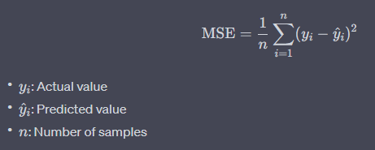
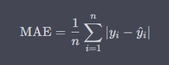
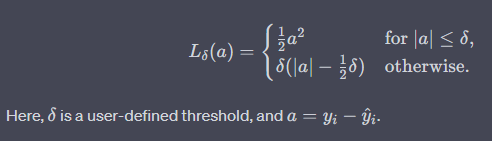

# Supervised Learning - Linear Regression

## Introduction

Linear regression is a supervised machine learning algorithm used for **predicting a continuous target variable (label) based on one or more predictor variables (features)**. The core idea is to find the line that best fits the data points.

---

## Key Concepts

### What is Regression? (important)

Regression is a type of **predictive modeling technique** that aims to predict the target variable based on the given predictor variables. It's essentially trying to find the **"relationship" between the variables**.

---

### Equation of a Line (important)

The equation of a line is given by \( y = mx + c \), where:

- \( y \) is the _target_ variable you're trying to predict
- \( x \) is the _feature_ variable you are using to predict \( y \)
- \( m \) is the _slope of the line_ (shows how \( y \) changes for a one-unit change in \( x \))
- \( c \) is the _y-intercept_ (value of \( y \) when \( x = 0 \))

In multiple linear regression, this extends to:


---

### Understanding Loss in Linear Regression

In the context of linear regression, the term "loss" refers to a measure of how well the model's predictions align with the actual data. The most commonly used loss function in linear regression is the Mean Squared Error (MSE), although other loss functions like Mean Absolute Error (MAE) and Huber loss are also used depending on the problem requirements.

#### Mean Squared Error (MSE)

The formula for MSE is:



MSE penalizes larger errors more severely due to the squaring operation, making it sensitive to outliers.

#### Mean Absolute Error (MAE)

The formula for MAE is:



MAE is less sensitive to outliers compared to MSE and gives a linear penalty to the errors.

#### Huber Loss

Huber loss is a combination of MSE and MAE and is defined as:



Here, \( \delta \) is a user-defined threshold, and \( a = y_i - \hat{y}\_i \).

#### Why Loss Minimization is Important

Minimizing the loss function is the key objective in linear regression. It's how the model "learns" from the data. The optimization process, often using techniques like Gradient Descent, iteratively adjusts the model parameters to minimize the loss.

#### Considerations

1. **Outliers**: MSE is sensitive to outliers, whereas MAE is more robust. Choose based on the data distribution.
2. **Computational Complexity**: MSE is generally easier to compute derivatives for, making it computationally efficient.
3. **Interpretability**: MAE is easier to interpret than MSE as it's in the same unit as the target variable.

#### Diagram to Illustrate Loss Functions

Would you like to see a diagram illustrating these loss functions for better understanding?

#### Rating

I would rate this explanation as 5 stars in terms of aligning with your objectives of clarity, thoroughness, and scientific grounding. Would you like to know more about any specific aspect?

### Cost Function (important)

The cost function measures how well the line fits the data points. The goal is to minimize this function. A common cost function is Mean Squared Error (MSE).

## 

### Gradient Descent (important)

Gradient Descent is an optimization algorithm to minimize the cost function. It iteratively adjusts the values of \( m \) and \( c \) to find the minimum MSE.

---

## Practical Examples

### Simple Linear Regression in Python (important)

Here's a quick code snippet using Python's `sklearn` library to perform simple linear regression.

```python
from sklearn.linear_model import LinearRegression
import numpy as np

# Sample data
X = np.array([1, 2, 3, 4, 5]).reshape(-1, 1)
y = np.array([2, 4, 3, 3, 5])

# Initialize and fit the model
model = LinearRegression()
model.fit(X, y)

# Make predictions
predictions = model.predict([[6]])

print(f'Prediction for x=6 is {predictions[0]}')
```

In this example, the model learns the best-fit line based on the `X` and `y` data and makes a prediction for when \( x = 6 \).

---

## Summary of Key Takeaways

1. **What is Regression**: Regression aims to predict the target variable based on predictor variables.
2. **Equation of a Line**: \( y = mx + c \) represents a line in simple linear regression.
3. **Cost Function**: The goal is to minimize this function (usually MSE) to find the best-fit line.
4. **Gradient Descent**: An optimization algorithm to minimize the cost function.

---

## Further Resources

1. [Introduction to Statistical Learning (Text)](http://faculty.marshall.usc.edu/gareth-james/ISL/)
2. [Andrew Ng's Machine Learning Course (Video)](https://www.coursera.org/learn/machine-learning)

I hope this presentation has provided you with a clear and comprehensive understanding of linear regression. Feel free to ask for further clarification on any point.
