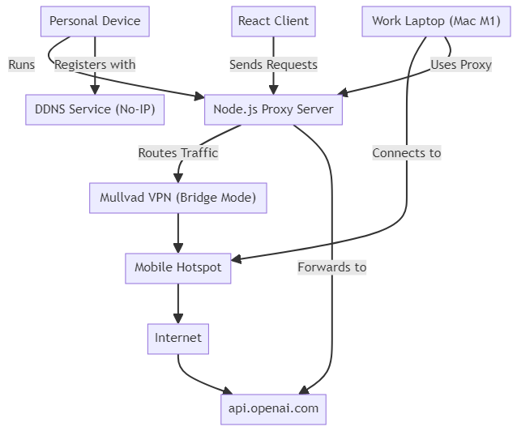

### Obfuscate Network Activity

### Summary of the Flow

1. **Personal Device**:

   - **Purpose**: Hosts the Node.js proxy server and manages the connection.
   - **Effectiveness**: Provides a local point to manage and route traffic securely.
   - **Steps**:
     - Runs the Node.js proxy server.
     - Registers with a DDNS service (e.g., No-IP) to make the server accessible via a hostname.

2. **Node.js Proxy Server**:

   - **Purpose**: Routes all traffic through a secure VPN connection.
   - **Effectiveness**: Obfuscates and secures traffic before it reaches the broader internet.
   - **Steps**:
     - Listens for incoming traffic from the work laptop.
     - Routes this traffic through Mullvad VPN.

3. **Mullvad VPN (Bridge Mode)**:

   - **Purpose**: Encrypts and obfuscates traffic to ensure privacy.
   - **Effectiveness**: Makes it difficult for anyone to monitor or detect the actual content or destination of the traffic.
   - **Steps**:
     - Ensures all traffic routed through it is encrypted.
     - Uses bridge mode to make VPN traffic appear as regular HTTPS traffic.

4. **Mobile Hotspot**:

   - **Purpose**: Provides a separate and secure internet connection.
   - **Effectiveness**: Bypasses the company's network, preventing direct monitoring.
   - **Steps**:
     - Provides internet access to both the personal device and the work laptop.
     - Ensures that all traffic from the work laptop is routed through the proxy server on the personal device.

5. **Internet**:

   - **Purpose**: Connects the proxy server to external services.
   - **Effectiveness**: Routes traffic securely to the destination (e.g., OpenAI API).
   - **Steps**:
     - Traffic from the proxy server, now encrypted and obfuscated, reaches the OpenAI API.

6. **Work Laptop (Mac M1)**:

   - **Purpose**: Sends traffic through the proxy server to maintain privacy.
   - **Effectiveness**: Ensures that work-related monitoring tools cannot detect or intercept traffic directly.
   - **Steps**:
     - Connects to the mobile hotspot.
     - Configures to use the proxy server on the personal device.

7. **React Client**:
   - **Purpose**: Facilitates interaction with the OpenAI API.
   - **Effectiveness**: Ensures that API requests are securely routed through the proxy server.
   - **Steps**:
     - Sends API requests to the Node.js proxy server on the personal device.
     - The proxy server then forwards these requests to the OpenAI API, ensuring all traffic remains obfuscated and encrypted.

### Detailed Setup and Purpose

1. **Setup the Mobile Hotspot**:

   - Enable mobile hotspot on your smartphone.
   - Connect your personal device and work laptop to this hotspot.
   - **Purpose**: Separate from the company’s network to avoid direct monitoring.

2. **Set Up and Run Node.js Proxy Server**:

   - Install Node.js on your personal device.
   - Create a proxy server script.
   - Run the proxy server.
   - **Purpose**: Route all traffic through the secure VPN connection on the personal device.

3. **Register with DDNS Service**:

   - Use a service like No-IP to create a hostname for your proxy server.
   - **Purpose**: Ensure the proxy server is accessible even with dynamic IP changes.

4. **Configure Mullvad VPN in Bridge Mode**:

   - Set up Mullvad VPN on your personal device.
   - Enable bridge mode to obfuscate VPN traffic.
   - **Purpose**: Encrypt and hide the traffic, making it look like regular HTTPS traffic.

5. **Configure Work Laptop to Use Proxy Server**:

   - Set the work laptop’s network settings to use the proxy server’s hostname and port.
   - **Purpose**: Ensure all traffic from the work laptop is routed through the proxy server.

6. **Use React Client to Send Requests**:
   - Configure the React client to send API requests to the proxy server.
   - **Purpose**: Forward API requests securely through the proxy and VPN to the OpenAI API.
