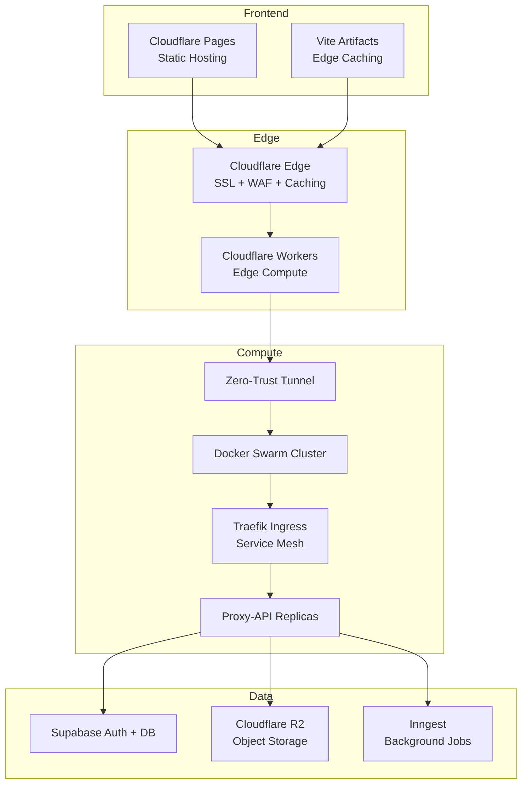
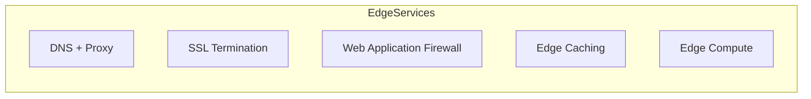
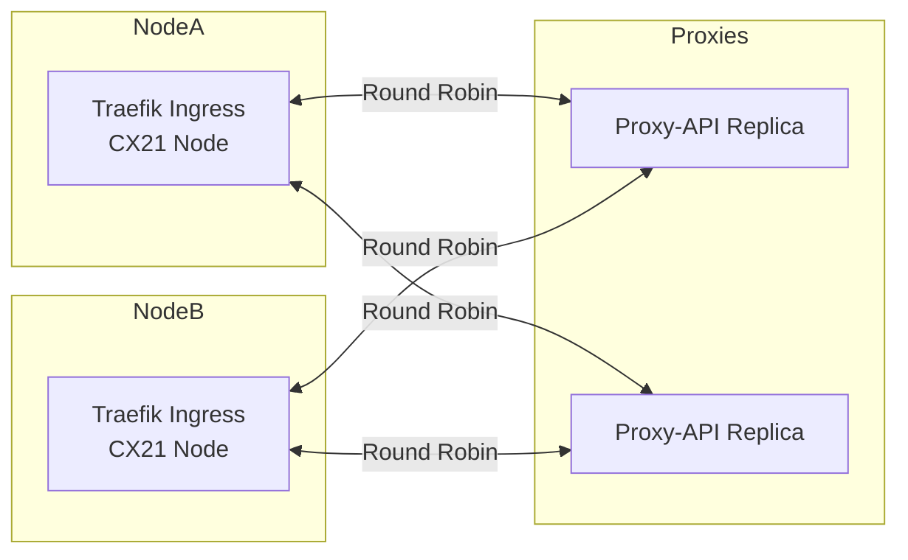
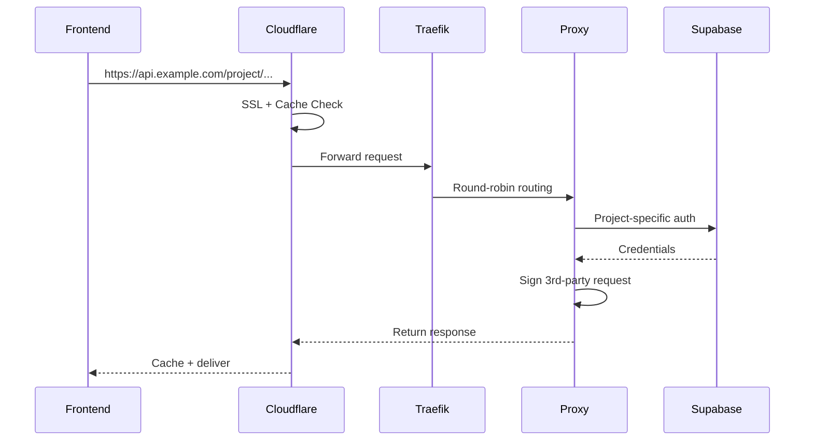
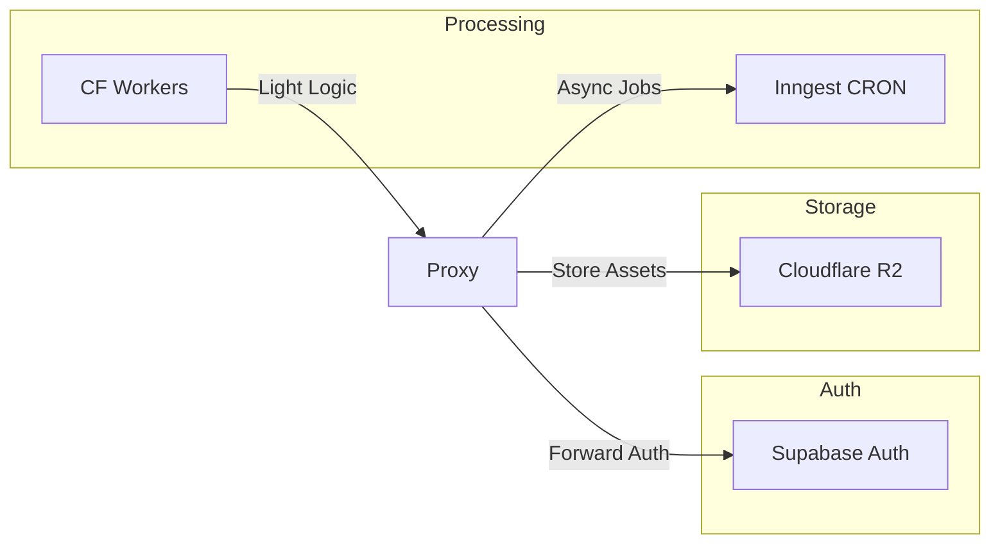
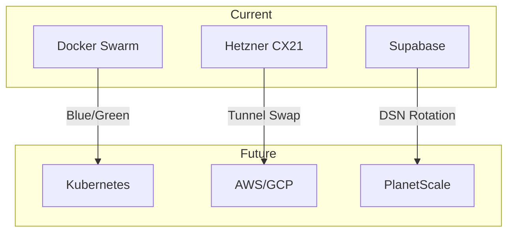
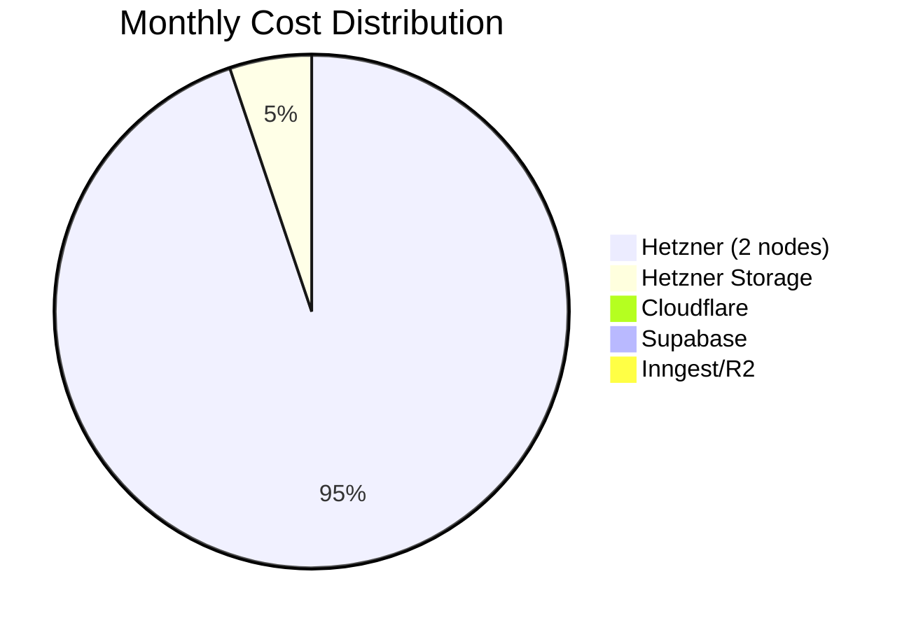

# Architecture

## Overview

**Core Value Proposition**  
A cost-optimized, multi-layered architecture that separates concerns while maintaining flexibility. Each layer provides specific value:
- **Frontend**: Global edge delivery with zero infrastructure
- **Edge**: Security, caching, and lightweight compute
- **Compute**: Scalable, multi-tenant API handling
- **Data**: Decoupled storage with modern service integration

---

## 1. Edge Layer – Cloudflare

### Key Components

### Component Breakdown
| Component | Function | Value Provided |
|---------|----------|----------------|
| **DNS/SSL** | Domain management + 15y wildcard certs | Zero-cost security foundation |
| **WAF** | Threat protection + rate limiting | Security without infrastructure overhead |
| **Caching** | Selective GET/OPTIONS caching | 70-90% origin load reduction |
| **Workers** | Pre-signed URLs, rate limiting | Edge logic without VM management |
| **Tunnel** | Private origin connectivity | Zero public IP exposure for backend |

---

## 2. Compute Layer – Hetzner + Swarm

### Cluster Architecture

### Cost Efficiency
| Component | Cost | Value |
|---------|------|-------|
| CX21 Nodes | €4.59/month | 2vCPU/4GB baseline compute |
| Private Network | Free | 10Gbps internal communication |
| Scaling | Docker service scale | €4.59/month per additional node |
| Load Balancing | Cloudflare DNS RR | Avoid €36.99/month LB cost |

---

## 3. Multi-Tenant Proxy Pattern

### Request Flow

### Key Advantages
1. **Shared Credential Vault**: Single secret store for multiple projects
2. **Horizontal Scaling**: Add replicas via `docker service scale`
3. **Cost Distribution**: Shared infrastructure costs across projects
4. **Caching Synergy**: Cloudflare cache keys on project ID

---

## 4. Data & Services Ecosystem

### Service Matrix

### Free Tier Optimization
| Service | Free Tier | Value Cap |
|-------|-----------|-----------|
| Supabase | 500MB DB + 50k MAU | Basic auth + relational data |
| R2 | 10GB storage | Media/object storage |
| Inngest | Unlimited CRON | Background processing |
| Workers | 100k req/day | Edge logic without servers |

---

## 5. Migration Pathways

### Upgrade Options

### Exit Strategy Values
- **Swarm → K8s**: Maintain Traefik ingress pattern
- **Hetzner → Cloud**: Keep Cloudflare fronting
- **Supabase → Postgres**: Abstract credentials through proxy

---

## Cost Model

### Breakdown

### Scaling Economics
- **Linear Growth**: +€4.59/month per additional node
- **Free Tier Protection**: Core services remain free until significant scale
- **DDoS Mitigation**: Cloudflare absorbs attacks at no extra cost

---

## Strengths & Improvements

### Architecture Scorecard
<!--
Mermaid's radarChart is not widely supported or may not render in all environments.
Below is a table alternative for architecture evaluation.
-->

| Criteria         | Score (out of 5) |
|------------------|------------------|
| **Cost**         | 4.5              |
| **Scalability**  | 3.5              |
| **Maintainability** | 4            |
| **Flexibility**  | 4.5              |
| **Security**     | 5                |
 