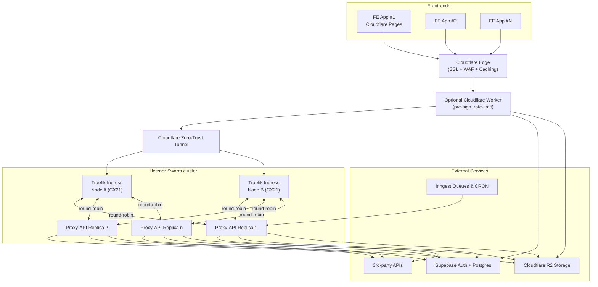

# Architecture


## Overview



**Summary – cheap, durable, swappable**

Run each front-end on **Cloudflare Pages** (static hosting + global edge cache), route all API calls through **Cloudflare** to a tiny **Traefik** cluster on 2 × Hetzner CX21 servers (< €5 month each).  
Inside the cluster, containerised “proxy-API” replicas share a **multi-tenant credential vault**, so **many projects → many proxies** instead of brittle 1-to-1 services.  
Supabase (auth + DB) lives off-cluster; low-CPU background tasks run on **Cloudflare Workers** or **Inngest**.  
Everything is free-tier or single-digit-euro except Hetzner compute, and you can replace any component later without rewriting code.

---

## 1. Edge layer – Cloudflare in front of everything
### DNS, SSL, WAF, caching  
* **Cloudflare Free plan** gives DNS, proxy, WAF & 15 y wildcard certs at $0 forever  ([Zero Trust & SASE Plans & Pricing - Cloudflare](https://www.cloudflare.com/plans/zero-trust-services/?utm_source=chatgpt.com)).  
* **Cache Rules** let you selectively cache GET/OPTIONS calls to the proxy and purge on deploy, cutting origin load  ([Cache Rules - Cloudflare Docs](https://developers.cloudflare.com/cache/how-to/cache-rules/?utm_source=chatgpt.com)).  
* **Zero-Trust Tunnels** (still free) keep Hetzner boxes off the public Internet while serving traffic via Cloudflare POPs  ([Zero Trust & SASE Plans & Pricing - Cloudflare](https://www.cloudflare.com/plans/zero-trust-services/?utm_source=chatgpt.com)).

### Static front-ends  
* Cloudflare Pages free tier → 500 builds/mo, 20-min build timeout; perfect for Vite artefacts  ([Limits · Cloudflare Pages docs](https://developers.cloudflare.com/pages/platform/limits/?utm_source=chatgpt.com)).

### Ultra-light compute burst  
* Use **Cloudflare Workers** for single-file APIs or pre-signing third-party requests; free tier allows 100 k req/day and 10 ms CPU/window  ([Limits · Cloudflare Workers docs](https://developers.cloudflare.com/workers/platform/limits/?utm_source=chatgpt.com)).

---

## 2. Core compute cluster – Hetzner Cloud

| Node | Spec | €/mo | Role |
|------|------|------|------|
| **CX21** | 2 vCPU / 4 GB / 40 GB SSD | **4.59**  ([Cheap hosted VPS by Hetzner: our cloud hosting services](https://www.hetzner.com/cloud?utm_source=chatgpt.com)) | Swarm master + proxy |
| **CX21-b** | same | 4.59 | Swarm worker + proxy |

*Add a third node later or burst new replicas in another Hetzner region.*

### Private networking & LB
* Hetzner gives free 10 Gbit internal networking; add a paid LB only if you need regional fail-over (starts ≈ €36.99/mo)  ([Load Balancer - Hetzner](https://www.hetzner.com/cloud/load-balancer/?utm_source=chatgpt.com)).  
* While tiny, use Cloudflare round-robin on two A-records instead of paying for the LB.

---

## 3. Cluster fabric

| Layer | Choice | Reason |
|-------|--------|--------|
| **Orchestrator** | **Docker Swarm** | <15 min set-up, gentle learning curve vs k3s ⁠— ideal for disposable projects  ([RPi Cluster: k3s vs swarm : r/homelab - Reddit](https://www.reddit.com/r/homelab/comments/qwbggs/rpi_cluster_k3s_vs_swarm/?utm_source=chatgpt.com)). |
| **Ingress** | **Traefik** | Native Swarm discovery + automatic Let’s Encrypt ACME certs  ([Let's Encrypt - Traefik Labs documentation](https://doc.traefik.io/traefik/https/acme/?utm_source=chatgpt.com)). |
| **Secrets** | Swarm secrets / SOPS files | Env-per-project, injected at runtime. |
| **Logs/metrics** | Loki + Promtail stack (optional) | One-binary, low RAM. |

---

## 4. Multi-tenant proxy-API pattern

```mermaid
flowchart LR
  subgraph Clients
    FE1["FE App #1"] -->|fetch| CF[(Cloudflare)]
    FE2["FE App #N"] -->|fetch| CF
  end

  CF -->|A or CNAME| TR[TLS-Term (Traefik)]
  TR --Docker net--> P1[Proxy-API replica 1]
  TR --Docker net--> P2[Proxy-API replica 2]

  subgraph Proxy Cluster
    P1 & P2 -->|forward| EXT[Third-party APIs]
    P1 & P2 --> PG[(Supabase DB)]
  end
```

### Request flow
1. Front-end hits `https://api.yourdomain.com/project-id/…`.
2. Cloudflare terminates SSL, attaches caching headers, forwards to Traefik over tunnel.
3. Traefik round-robins to any healthy proxy container.
4. Proxy middleware:
   * looks up `project-id` → grabs credentials from Swarm secret or Supabase table,
   * signs outbound call,
   * returns & optionally stores response in Supabase/R2.
5. Cloudflare edge caches safe verbs (GET, OPTIONS) per `project-id`.

### Why it’s cheap & elastic
* Add `docker service scale proxy=4` when traffic spikes; Swarm re-balances within seconds.
* Extra CX21 costs another €4.59; still below one managed LB elsewhere.
* Cloudflare absorbs DDoS/WAF and most cached reads.

---

## 5. Data & storage

| Need | Service | Free tier |
|------|---------|-----------|
| Auth + SQL | **Supabase** – 500 MB DB, 50 k MAU free  ([Handling Routing in Functions | Supabase Docs](https://supabase.com/docs/guides/functions/routing?utm_source=chatgpt.com)) |
| Object store | **Cloudflare R2** – 10 GB + 1 M class-A ops/mo free  ([Pricing · Cloudflare R2 docs](https://developers.cloudflare.com/r2/pricing/?utm_source=chatgpt.com)) |
| Background jobs | **Inngest** – generous perpetual free tier for queues & CRONs  ([Pricing - Inngest](https://www.inngest.com/pricing?utm_source=chatgpt.com)) |

Supabase Edge Functions can co-locate simple auth-aware logic; combine endpoints into one function to dodge cold-start overheads  ([Handling Routing in Functions | Supabase Docs](https://supabase.com/docs/guides/functions/routing?utm_source=chatgpt.com)).

---

## 6. CI/CD & ops

1. **GitHub Actions →** build Docker image, push to GitHub Container Registry (free for public, cheap for private).  
2. SSH into master via Cloudflare Tunnel, `docker stack deploy`.  
3. Optional: **Flux** or **ArgoCD** if config drift becomes painful (runs fine on 512 MB).  
4. Alerting: BetterStack Uptime (50 checks free) or Cloudflare Health Checks.

---

## 7. Rough monthly cost model (two projects)

| Item | Qty | Unit €/mo | Subtotal |
|------|-----|-----------|----------|
| Hetzner CX21 | 2 | 4.59 | **9.18** |
| Hetzner Vol-snapshot | 1 | 0.50 | 0.50 |
| Cloudflare | 1 | 0 | 0 |
| Supabase project | 1 | 0 | 0 |
| Inngest / Workers / R2 | — | 0 | 0 |
| **Total** | | | **≈ €9.68** |

Add +€4.59 per extra compute node; everything else scales on free or pay-per-use plans.

---

## 8. Migration / exit ramps

| Current | Swap later | Zero-downtime path |
|---------|------------|--------------------|
| Swarm | k3s / managed k8s | Deploy k3s alongside, migrate services with blue-green DNS. |
| Hetzner | AWS / GCP | Move Tunnel origin to new IPs, keep Cloudflare front. |
| Supabase | PlanetScale / Neon / on-prem PG | Proxy already abstracts DSN; rotate secret → done. |

---

### Key takeaways
* **Many-to-many proxies + Cloudflare cache** give you one set of tiny servers that survive bursts while keeping costs in single digits.  
* **Swarm + Traefik** hits the sweet spot for “throw-away but can grow”.  
* Every component is either OSS or pay-as-you-go, so when a project “simply dies” you shut it down with no sunk licence fees.

## Summary  
Overall, this transitory “ultra-low-cost” stack earns **★★★★☆ (4/5 stars)**. It brilliantly leverages **free tiers** and **€4.59/month** Hetzner nodes to deliver global static hosting, SSL, proxy-API routing, and serverless burst compute—all for under **€10/month**. However, to push reliability, observability, and seamless scaling further, consider enhancements around orchestration, high-availability, monitoring, and free-tier limits.

---

## Rating: ★★★★☆  

---

## Strengths  

### 1. Extreme Cost Efficiency  
- **Cloudflare Pages** provides unlimited bandwidth and **500 builds/month** on its Free plan—zero hosting cost for Vite artifacts  ([Limits · Cloudflare Pages docs](https://developers.cloudflare.com/pages/platform/limits/?utm_source=chatgpt.com)).  
- **Hetzner CX21** nodes cost just **€4.59/month** each with solid performance and support, making the origin cheap yet reliable  ([New CX22 vs old CX21 : r/hetzner - Reddit](https://www.reddit.com/r/hetzner/comments/1dc4oqz/new_cx22_vs_old_cx21/?utm_source=chatgpt.com)).  
- **Cloudflare Workers** handles burst compute (100 k requests/day) free, offloading light API logic from your origin  ([Limits · Cloudflare Workers docs](https://developers.cloudflare.com/workers/platform/limits/?utm_source=chatgpt.com)).  
- **Cloudflare R2** offers **10 GB storage** and free egress—ideal for object storage without surprise bills  ([r/CloudFlare on Reddit: R2 Pricing: Serving Files/Images is *Not* Free](https://www.reddit.com/r/CloudFlare/comments/1ic51x1/r2_pricing_serving_filesimages_is_not_free/?utm_source=chatgpt.com)).  

### 2. Simplified Multi-Tenant Proxy Model  
- A **many-to-many proxy** on Docker Swarm + Traefik lets **N front-ends → N proxies**, centralizing credential vaults and avoiding per-project servers.  
- **Traefik’s** built-in ACME support automates SSL issuance, eliminating manual cert management  ([Let's Encrypt - Traefik Labs documentation](https://doc.traefik.io/traefik/https/acme/?utm_source=chatgpt.com)).  

### 3. Minimal Ops & Easy Exit Ramps  
- **Docker Swarm** boots in minutes for small clusters—no Kubernetes overhead required  ([Kubernetes vs Docker Swarm: Which to Choose for Containers?](https://last9.io/blog/kubernetes-vs-docker-swarm/?utm_source=chatgpt.com)).  
- Every component (Cloudflare, Supabase, Workers, Inngest) can be swapped later (e.g., to k3s, AWS, PlanetScale) without code rewrites.  

---

## Areas for Improvement  

### 1. Orchestration & High Availability  
- **Docker Swarm** is lightweight but lacks Kubernetes-style self-healing, auto-scaling, and rich scheduling. Consider **migrating to k3s** or a managed k8s when projects hit sustained traction  ([Docker Swarm vs. Kubernetes : A Detailed Comparison - Reddit](https://www.reddit.com/r/kubernetes/comments/xc7kzz/docker_swarm_vs_kubernetes_a_detailed_comparison/?utm_source=chatgpt.com)).  
- Running only **two CX21 nodes** means no quorum for leader election if one fails—adding a third node or using an external load balancer improves uptime.

### 2. Free-Tier Pitfalls & Limits  
- **Supabase free tier** pauses inactive projects after 1 week and caps at **2 active projects**; ensure you keep proxies “pinged” or upgrade before critical use  ([Pricing & Fees - Supabase](https://supabase.com/pricing?utm_source=chatgpt.com)) ([About billing on Supabase](https://supabase.com/docs/guides/platform/billing-on-supabase?utm_source=chatgpt.com)).  
- **Cloudflare Workers** limit of **100 k requests/day** could be a bottleneck under moderate traffic spikes; plan rate-limiting or edge caching strategies  ([Pricing - Workers - Cloudflare Docs](https://developers.cloudflare.com/workers/platform/pricing/?utm_source=chatgpt.com)).  
- **Cloudflare R2** bills for Class B operations (GetObject) beyond a threshold; monitor usage to avoid unexpected fees  ([r/CloudFlare on Reddit: R2 Pricing: Serving Files/Images is *Not* Free](https://www.reddit.com/r/CloudFlare/comments/1ic51x1/r2_pricing_serving_filesimages_is_not_free/?utm_source=chatgpt.com)).

### 3. Observability & Monitoring  
- Current stack lacks built-in logging, metrics, and tracing. Integrate **Promtail + Loki** or a SaaS like **BetterStack** for logs and **Uptime Robot** for health checks.  
- Use **Traefik’s** metrics endpoint or **Cloudflare Analytics** to monitor edge traffic and proxy performance.

### 4. Secret Management & Configuration  
- While **Swarm secrets** work, consider **HashiCorp Vault** or **Doppler** for multi-region secret distribution and rotation, especially as projects diversify.

### 5. Performance & Latency  
- **Cloudflare Tunnel** can introduce latency (~3–4 Mbps throughput in some tests) versus direct origin access; benchmark and, if needed, use an **Argo Tunnel** Enterprise or lightweight VPN alternative  ([Cloudflare Proxy vs Cloudflare tunnel performance : r/selfhosted](https://www.reddit.com/r/selfhosted/comments/17egp4d/cloudflare_proxy_vs_cloudflare_tunnel_performance/?utm_source=chatgpt.com)).  
- Consider **Cloudflare Load Balancer** or **round-robin A records** with health checks to evenly distribute traffic and reduce single-point slowdowns.

---

## Recommendations  

1. **Add a Third Node** in Hetzner Swarm for quorum and basic HA—€4.59/month extra.  
2. **Plan Orchestration Migration** to k3s or EKS when services exceed 50 containers, unlocking auto-scaling and advanced scheduling.  
3. **Implement Centralized Logging** (Loki + Grafana) and **Uptime Monitoring** (BetterStack, UptimeRobot) to catch failures early.  
4. **Automate Secret Rotation** via Vault or Doppler to secure multi-project credentials.  
5. **Optimize Edge Caching** with tailored Cloudflare Cache Rules to minimize Worker and proxy hits.  
6. **Track Free-Tier Usage** with alerts for Supabase, Workers, and R2 to avoid throttling mid-experiment.  

With these tweaks, you’ll retain the **€10-per-month** baseline while boosting resilience, observability, and headroom for growth—keeping costs in check as you validate and scale rapidly.
