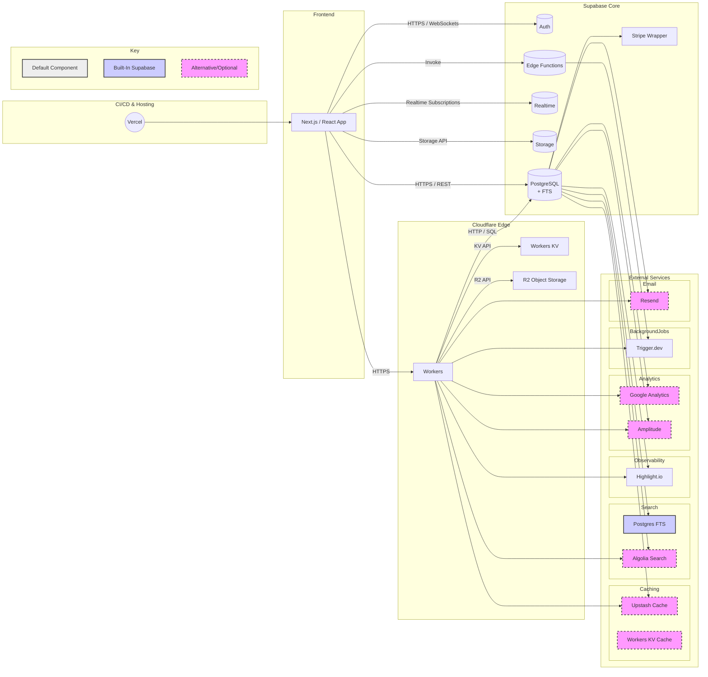
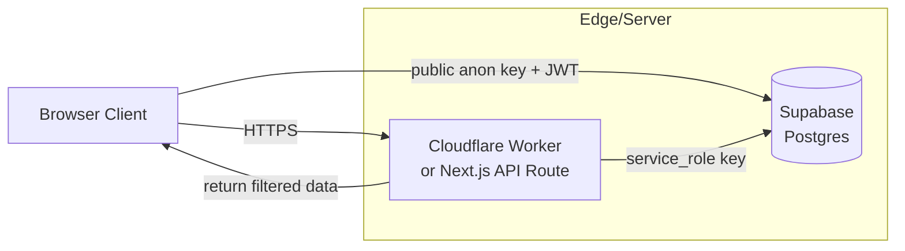

# SupaEdge Stack Architecture Guide

This document summarizes the core concepts, architecture, pros, and cons of using a Backend-as-a-Service (BaaS) stack centered around Supabase and Cloudflare Workers, referred to as the "SupaEdge Stack", based on the provided PDF.

## Core Idea: Leveraging BaaS and Edge Computing for MVPs

The central theme is using Cloudflare Workers and Supabase to rapidly build and deploy Minimum Viable Products (MVPs) with minimal infrastructure overhead and cost.

### Cloudflare Workers

* **What they are**: Serverless functions running on Cloudflare's global edge network, executing code (JavaScript, TypeScript, WebAssembly) close to users in response to HTTP requests.
* **Comparison to AWS Lambda**: Both are serverless, but Workers use V8 isolates (faster cold starts, lower memory) while Lambda uses containers. Workers have shorter execution limits (30s vs. 15min for Lambda) and primarily support JS/WASM, whereas Lambda supports more languages. Workers excel at edge computing and low-latency tasks.
* **Free Tier**: Generous free plan suitable for MVPs, offering 100,000 requests/day, 10ms CPU time/request, up to 100 scripts, KV storage, and more.
* **Paid Plan**: Starts at $5/month for increased limits (e.g., 10 million requests/month, 30s CPU time).
* **Use Cases**: Edge logic, lightweight APIs, content modification, authentication.

### Supabase

* **What it is**: An open-source Firebase alternative providing a suite of backend tools built around a managed PostgreSQL database.
* **Key Features**: Managed PostgreSQL, instant RESTful APIs, built-in authentication, real-time subscriptions, edge functions, and file storage.
* **Ideal for Startups**: Open-source, cost-effective scaling (generous free tier), great developer experience, rapid development capabilities.
* **Limitations**: Potential execution timeouts for long-running tasks, limited runtime support for Edge Functions (JS/TS via Deno only), potential scaling complexities, and vendor lock-in concerns.

## The Proposed "SupaEdge Stack"

This stack combines Supabase as the core BaaS with Cloudflare Workers for edge logic, augmented by other specialized services.

### Components:

1.  **Core BaaS**: Supabase (Postgres DB, Auth, Realtime, Storage, Edge Functions).
2.  **Serverless Logic & Edge Caching**: Cloudflare Workers (ultra low-latency functions), Workers KV (key-value cache), R2 (object storage).
3.  **Caching Layer**: KeyDB (multithreaded, Redis-compatible cache) or Upstash (serverless Redis, generous free tier, fully managed), Cloudflare Workers KV (generous free tier).
4.  **Search**: PostgreSQL Full-Text Search (built-in, no extra cost) and/or Algolia Community Plan (free for up to 10,000 records/100,000 ops/month, fully managed).
5.  **Observability & Analytics**: Highlight.io (error/performance monitoring, session replay, generous free tier), Google Analytics (mainstream), Amplitude (product analytics, free for non-commercial).
6.  **Frontend Hosting & CI/CD**: Vercel.
7.  **Payments & Billing**: Stripe Wrapper (via Supabase).
8.  **Background Jobs & Workflows**: Trigger.dev.
9.  **Transactional Email**: Resend (API for sending emails, generous free tier).

### Architecture Diagram (Mermaid)

### How it Replaces a Traditional Stack (Node/Postgres/Prisma/Cron)

* **Data Layer & ORM**: Managed Supabase Postgres replaces self-hosted Postgres. Supabase auto-generates APIs & clients, reducing the need for Prisma (though Prisma can still be used).
* **Business Logic & API**: Supabase Edge Functions & Cloudflare Workers replace Node.js/Express servers, offering serverless execution at the edge.
* **Scheduled Jobs**: Supabase Cron (in-DB) & Trigger.dev replace crontab or dedicated worker processes like Bull.
* **Caching**: KeyDB or Workers KV replace self-managed Redis.
* **Search**: Postgres FTS or Algolia Community Plan replace Meilisearch/Elasticsearch/OpenSearch clusters.
* **Hosting & CI/CD**: Vercel replaces VPS/Kubernetes setups.
* **Payments**: Supabase Stripe Wrapper simplifies integration compared to manual SDK implementation.
* **Monitoring**: Integrated Highlight.io replaces Sentry; Google Analytics and Amplitude replace PostHog.

**Bottom Line**: This stack significantly reduces operational overhead (DB ops, server maintenance, job scheduling, CI/CD pipelines) accelerating development.

## Cost Comparison Table

Here is a markdown table summarizing the costs of the tools and services mentioned in the SupaEdge Stack Architecture Guide, based on the provided text and search results:

| Tool/Service                | Purpose                                          | Free Tier Details                                                                                                                               | Paid Plan Details                                                                                                                                                                 |
|-----------------------------|--------------------------------------------------|-------------------------------------------------------------------------------------------------------------------------------------------------|-----------------------------------------------------------------------------------------------------------------------------------------------------------------------------------|
| **Cloudflare Workers** | Serverless functions at the edge                 | Generous free plan: 100,000 requests/day, 10ms CPU time/request, up to 100 scripts. Includes limited Workers KV and R2 usage.                   | Starts at $5/month for increased limits (e.g., 10 million requests/month, 30s CPU time, 30M CPU ms/month). Overage charges apply for requests, CPU time.                             |
| **Supabase** | Core BaaS (DB, Auth, Realtime, Storage, Edge Funcs) | Generous free tier: Unlimited API requests, 50k monthly active users, 500MB database, 5GB bandwidth, 1GB file storage.                           | Pro plan starts at $25/month (100k monthly active users, 8GB database, 250GB bandwidth, 100GB file storage, and more). Team plan at $599/month. Usage-based fees for exceeding limits. |
| **Cloudflare Workers KV** | Edge Key-Value Cache                             | Included with Workers Free Tier: 100,000 read operations/day, 1,000 write, delete, list operations/day, 1GB storage.                            | Included with Workers Paid Tier: 10 million read operations/month, 1 million write, delete, and list operations/month, 1GB storage. Overage charges for reads, writes, storage. |
| **Cloudflare R2** | S3-compatible Object Storage                     | Free tier includes 10 GB storage/month, 1,000,000 Class A operations/month, 10,000,000 Class B operations/month. Zero egress fees.                   | Storage beyond free tier is $0.015/GB. Class A operations are $4.50/million. Class B operations are $0.36/million.                                                                  |
| **Upstash** | Serverless Redis Cache (Managed)                 | Free Tier: 256MB data size, 500K commands per month, one free database.                                                                         | Pay-as-you-go plan with costs for requests ($0.20 per 100K), bandwidth ($0.03/GB after 200GB free), and storage ($0.25/GB after 1GB free). Fixed plans available starting at $10/month. |
| **PostgreSQL Full-Text Search** | Built-in Database Search Feature               | Built into PostgreSQL; cost is included as part of the PostgreSQL database hosting (e.g., within Supabase).                                    | No separate cost for the feature itself.                                                                                                                                          |
| **Algolia** | Managed Search-as-a-Service                    | Community Plan: Free for up to 10,000 search requests/month and 1 million records.                                                              | Pay-as-you-go options start at $0.50 per additional 1k search requests and $0.40 per additional 1k records/month. Annual plans (Premium, Elevate) have custom pricing.             |
| **Highlight.io** | Fullstack Monitoring & Session Replay          | Free Forever plan: 500 monthly sessions, AI error grouping, up to 15 seats.                                                                     | Pay-as-you-go starts at $50/month, including more sessions, errors, logs, and traces. Business and Enterprise plans offer higher limits and features. Usage-based pricing applies.    |
| **Google Analytics** | Web Analytics (mainstream)                  | Free for most use cases, unlimited events, widely used.                                                                                          | Google Analytics 360 (enterprise) starts at $150,000/year, but not needed for most startups.                                                                                      |
| **Amplitude** | Product Analytics & Event Tracking               | Free tier: Up to 10 million events/month, core analytics features.                                                                              | Growth/Enterprise plans offer advanced features, higher event limits, and support. Pricing is usage-based.                                                                        |
| **Vercel** | Frontend Hosting & CI/CD                         | Hobby (Free) plan provides generous allowances for personal projects, including serverless functions, global deployments, and bandwidth.         | Pro plan starts at $20 per member per month, offering higher limits, team features, and priority support. Enterprise plans are available for larger organizations.                |
| **Stripe Wrapper (via Supabase)** | Payments Integration Helper                    | The cost is primarily the standard Stripe transaction fees. Any Supabase usage (like Edge Functions for webhooks) would incur Supabase costs. | Stripe's pricing is based on transaction volume and types. Associated Supabase costs would fall under your Supabase plan's usage fees.                                             |
| **Trigger.dev** | Background Jobs & Workflows                    | Free plan includes $5 of monthly usage credit and limited concurrency.                                                                            | Paid plans start at $10/month with $10 usage included, increasing limits on runs, schedules, and concurrency. Usage is based on compute time and run invocations.                  |
| **Meilisearch** | Open-source Search Engine (Self-hosted/Managed) | Offers a 14-day free trial for their Cloud service. A Build plan starts at $30/month.                                                          | Build plan ($30/month) includes 50k searches and 100k documents. Pro plan starts at $300/month. Enterprise plans have custom pricing. Usage fees apply based on searches and documents. |
| **Sentry** | Error Monitoring & Performance                   | Developer plan is free for one user and includes a quota of errors and performance monitoring spans.                                            | Team plan starts at $26/month with increased quotas and features. Business and Enterprise plans offer higher limits, longer data retention, and advanced capabilities. Usage is event-based. |
| **PostHog** | Product Analytics & Data Platform                | Free tier includes 1 million product analytics events, 1 million group analytics events, 1 million data pipeline events, and 2,500 mobile recordings per month. | Usage-based pricing applies after the free limits, with costs per event or recording decreasing at higher volumes. Teams plan is $450/mo.                                        |
| **Kestra** | Declarative Orchestration (Self-hosted/Managed)  | Open-Source Edition is free to use and self-host.                                                                                               | Enterprise Edition has per-instance pricing and offers additional features for larger organizations.                                                                             |
| **Nx** | Monorepo Development Tool                        | An open-source development tool/framework, free to use.                                                                                         | No direct cost for the Nx tool itself. Costs would relate to hosting and other services used in the project.                                                                      |
| **RedwoodJS** | Fullstack Framework                            | An open-source fullstack framework, free to use.                                                                                                | No direct cost for the RedwoodJS framework itself. Costs would be associated with deployment platforms (like Vercel) and other services.                                           |
| **T3 Stack** | Opinionated Fullstack Starter Kit                | A collection of open-source libraries and conventions, free to use.                                                                             | No direct cost for the T3 Stack itself. Costs depend entirely on the individual services integrated (e.g., databases, hosting, authentication services).                         |
| **Resend** | Transactional Email API                           | Free tier: 3,000 emails/month.                                                                                                                  | Pay-as-you-go: $0.0025 per email after free tier.                                                                                                                                |

## Security: Avoiding Frontend API Credentials

* **Risk**: Embedding sensitive keys (like Supabase `service_role` key) in the frontend allows extraction, potentially leading to unauthorized access and cost issues.
* **Solution**: Use backend/edge proxies (Cloudflare Workers, Next.js API Routes, Supabase Edge Functions) to handle requests requiring sensitive keys.
    * Store secrets (e.g., `service_role` key) securely as environment variables or secrets on the server/edge side.
    * The frontend only interacts with these secure proxy endpoints or uses the public Supabase `anon` key.
* **Safe Use of `anon` Key**: The public `anon` key is safe *only* when strict Row-Level Security (RLS) policies are enabled on all tables to limit access. Any operation needing higher privileges must go through the backend proxy.

### Secure Flow Example (Mermaid)

## Rating and Enhancements

* **Initial Rating**: ★★★★☆ (4/5 Stars).
    * **Pros**: Rapid MVP development, low-ops, edge performance, cost-effective scaling.
    * **Cons**: Potential vendor lock-in, platform maturity/limits (Edge Functions, Trigger.dev), limits on long-running tasks compared to self-managed.
* **Making it 5/5 (without losing simplicity)**:
    1.  **Eliminate Lock-In**: Use adapter patterns (e.g., "Supasafe"), logical replication to a separate Postgres, keep business logic out of DB procedures.
    2.  **Support Long Workflows**: Use paid Cloudflare Workers Unbound (lifts 30s limit), Trigger.dev Checkpointing, or Edge Function chaining.
    3.  **Global Scale**: Use Supabase Read Replicas, Worker failover logic, edge caching (Workers KV).
    4.  **Simplify Orchestration**: Use declarative workflows (Kestra), monorepo best practices (Nx), or fullstack frameworks (RedwoodJS, T3 Stack).
    5.  **Enhance Observability**: Use zero-config Highlight.io integration, direct Postgres-to-Google Analytics or Amplitude streaming.
    6.  **Developer Joy & Costs**: Use low-code admin panels, leverage free tiers effectively, rely on predictable pay-as-you-go billing.

## When a Traditional VPS is Still Needed

While the SupaEdge stack covers most web app needs, a VPS is better suited for:

1.  **Stateful & Long-Running Processes**: Tasks exceeding serverless CPU/memory/time limits (e.g., heavy compute, ML inference, video transcoding), persistent daemons, sub-second cron jobs.
2.  **Custom Network Protocols**: Hosting services requiring raw TCP/UDP (FTP, MQTT, SSH, custom protocols), hosting SMTP relays.
3.  **Arbitrary Containers & OS Access**: Running Docker images, custom binaries (FFmpeg), specific OS dependencies, needing root access.
4.  **Specialized Languages/Runtimes**: Using languages not supported by Workers/Edge Functions (e.g., Java, .NET).
5.  **Fine-Grained Control/Dedicated Resources**: Needing custom firewall rules, kernel tuning, specific network configs (VPNs), deploying custom observability stacks (Prometheus), or requiring cost-effective dedicated resources for consistent high load.
6.  **Inbound Services on Non-HTTP Ports**: Hosting services listening on ports other than HTTP/WebSocket.

**In essence**: Use the SupaEdge stack for stateless web APIs, real-time features, standard backend tasks. Use a VPS for persistent services, heavy compute, custom binaries/protocols, and full system control.
