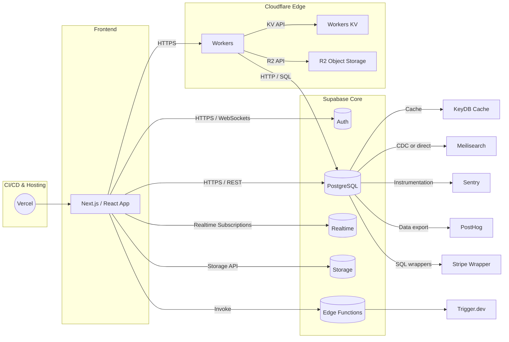
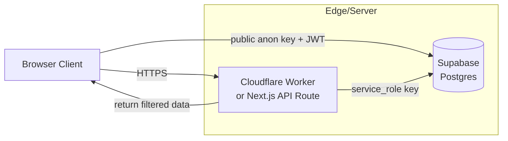

# SupaEdge Stack Architecture Guide

This document summarizes the core concepts, architecture, pros, and cons of using a Backend-as-a-Service (BaaS) stack centered around Supabase and Cloudflare Workers, referred to as the "SupaEdge Stack", based on the provided PDF.

## Core Idea: Leveraging BaaS and Edge Computing for MVPs

The central theme is using Cloudflare Workers and Supabase to rapidly build and deploy Minimum Viable Products (MVPs) with minimal infrastructure overhead and cost.

### Cloudflare Workers

* **What they are**: Serverless functions running on Cloudflare's global edge network, executing code (JavaScript, TypeScript, WebAssembly) close to users in response to HTTP requests.
* **Comparison to AWS Lambda**: Both are serverless, but Workers use V8 isolates (faster cold starts, lower memory) while Lambda uses containers. Workers have shorter execution limits (30s vs. 15min for Lambda) and primarily support JS/WASM, whereas Lambda supports more languages. Workers excel at edge computing and low-latency tasks.
* **Free Tier**: Generous free plan suitable for MVPs, offering 100,000 requests/day, 10ms CPU time/request, up to 100 scripts, KV storage, and more.
* **Paid Plan**: Starts at $5/month for increased limits (e.g., 10 million requests/month, 30s CPU time).
* **Use Cases**: Edge logic, lightweight APIs, content modification, authentication.

### Supabase

* **What it is**: An open-source Firebase alternative providing a suite of backend tools built around a managed PostgreSQL database.
* **Key Features**: Managed PostgreSQL, instant RESTful APIs, built-in authentication, real-time subscriptions, edge functions, and file storage.
* **Ideal for Startups**: Open-source, cost-effective scaling (generous free tier), great developer experience, rapid development capabilities.
* **Limitations**: Potential execution timeouts for long-running tasks, limited runtime support for Edge Functions (JS/TS via Deno only), potential scaling complexities, and vendor lock-in concerns.

## The Proposed "SupaEdge Stack"

This stack combines Supabase as the core BaaS with Cloudflare Workers for edge logic, augmented by other specialized services.

### Components:

1.  **Core BaaS**: Supabase (Postgres DB, Auth, Realtime, Storage, Edge Functions).
2.  **Serverless Logic & Edge Caching**: Cloudflare Workers (ultra low-latency functions), Workers KV (key-value cache), R2 (object storage).
3.  **Caching Layer**: KeyDB (multithreaded, Redis-compatible cache).
4.  **Search**: PostgreSQL Full-Text Search (built-in) and/or Meilisearch (typo-tolerant search).
5.  **Observability & Analytics**: Sentry (error/performance monitoring), PostHog (product analytics).
6.  **Frontend Hosting & CI/CD**: Vercel.
7.  **Payments & Billing**: Stripe Wrapper (via Supabase).
8.  **Background Jobs & Workflows**: Trigger.dev.

### Architecture Diagram (Mermaid)

### How it Replaces a Traditional Stack (Node/Postgres/Prisma/Cron)

* **Data Layer & ORM**: Managed Supabase Postgres replaces self-hosted Postgres. Supabase auto-generates APIs & clients, reducing the need for Prisma (though Prisma can still be used).
* **Business Logic & API**: Supabase Edge Functions & Cloudflare Workers replace Node.js/Express servers, offering serverless execution at the edge.
* **Scheduled Jobs**: Supabase Cron (in-DB) & Trigger.dev replace crontab or dedicated worker processes like Bull.
* **Caching**: KeyDB or Workers KV replace self-managed Redis.
* **Search**: Postgres FTS or Meilisearch replace Elasticsearch/OpenSearch clusters.
* **Hosting & CI/CD**: Vercel replaces VPS/Kubernetes setups.
* **Payments**: Supabase Stripe Wrapper simplifies integration compared to manual SDK implementation.
* **Monitoring**: Integrated Sentry & PostHog replace custom monitoring pipelines.

**Bottom Line**: This stack significantly reduces operational overhead (DB ops, server maintenance, job scheduling, CI/CD pipelines) accelerating development.

## Security: Avoiding Frontend API Credentials

* **Risk**: Embedding sensitive keys (like Supabase `service_role` key) in the frontend allows extraction, potentially leading to unauthorized access and cost issues.
* **Solution**: Use backend/edge proxies (Cloudflare Workers, Next.js API Routes, Supabase Edge Functions) to handle requests requiring sensitive keys.
    * Store secrets (e.g., `service_role` key) securely as environment variables or secrets on the server/edge side.
    * The frontend only interacts with these secure proxy endpoints or uses the public Supabase `anon` key.
* **Safe Use of `anon` Key**: The public `anon` key is safe *only* when strict Row-Level Security (RLS) policies are enabled on all tables to limit access. Any operation needing higher privileges must go through the backend proxy.

### Secure Flow Example (Mermaid)

## Rating and Enhancements

* **Initial Rating**: ★★★★☆ (4/5 Stars).
    * **Pros**: Rapid MVP development, low-ops, edge performance, cost-effective scaling.
    * **Cons**: Potential vendor lock-in, platform maturity/limits (Edge Functions, Trigger.dev), limits on long-running tasks compared to self-managed.
* **Making it 5/5 (without losing simplicity)**:
    1.  **Eliminate Lock-In**: Use adapter patterns (e.g., "Supasafe"), logical replication to a separate Postgres, keep business logic out of DB procedures.
    2.  **Support Long Workflows**: Use paid Cloudflare Workers Unbound (lifts 30s limit), Trigger.dev Checkpointing, or Edge Function chaining.
    3.  **Global Scale**: Use Supabase Read Replicas, Worker failover logic, edge caching (Workers KV).
    4.  **Simplify Orchestration**: Use declarative workflows (Kestra), monorepo best practices (Nx), or fullstack frameworks (RedwoodJS, T3 Stack).
    5.  **Enhance Observability**: Use zero-config Sentry integration, direct Postgres-to-PostHog streaming.
    6.  **Developer Joy & Costs**: Use low-code admin panels, leverage free tiers effectively, rely on predictable pay-as-you-go billing.

## When a Traditional VPS is Still Needed

While the SupaEdge stack covers most web app needs, a VPS is better suited for:

1.  **Stateful & Long-Running Processes**: Tasks exceeding serverless CPU/memory/time limits (e.g., heavy compute, ML inference, video transcoding), persistent daemons, sub-second cron jobs.
2.  **Custom Network Protocols**: Hosting services requiring raw TCP/UDP (FTP, MQTT, SSH, custom protocols), hosting SMTP relays.
3.  **Arbitrary Containers & OS Access**: Running Docker images, custom binaries (FFmpeg), specific OS dependencies, needing root access.
4.  **Specialized Languages/Runtimes**: Using languages not supported by Workers/Edge Functions (e.g., Java, .NET).
5.  **Fine-Grained Control/Dedicated Resources**: Needing custom firewall rules, kernel tuning, specific network configs (VPNs), deploying custom observability stacks (Prometheus), or requiring cost-effective dedicated resources for consistent high load.
6.  **Inbound Services on Non-HTTP Ports**: Hosting services listening on ports other than HTTP/WebSocket.

**In essence**: Use the SupaEdge stack for stateless web APIs, real-time features, standard backend tasks. Use a VPS for persistent services, heavy compute, custom binaries/protocols, and full system control.
