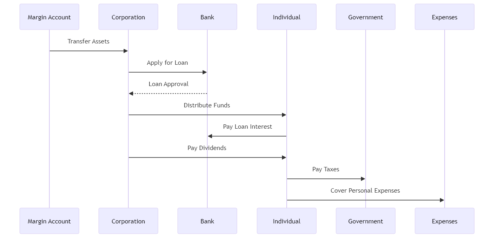
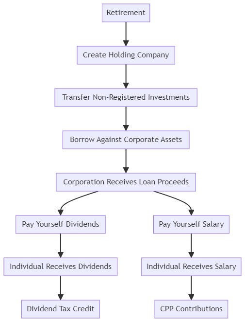

### Buy Borrow Die x Corporation

Using a corporation to implement the "buy, borrow, die" strategy can indeed offer benefits, particularly when it comes to potentially better loan interest rates and other tax planning opportunities. Here's how you can structure this strategy:

### 1. **Create a Corporation**

- **Formation**: Establish a Canadian corporation.
- **Assets**: Transfer your taxable investments (currently in the margin account) to the corporation. This might trigger capital gains tax at the time of transfer, so it should be planned carefully.
- **TFSA and RRSP**: Keep these accounts in your personal name since they have significant tax advantages that cannot be replicated within a corporation.

### 2. **Borrow Through the Corporation**

- **How**: The corporation borrows against its assets (your investments).
- **Interest Rates**: Corporations may access loans at better interest rates due to potentially larger assets and the perceived stability of a corporate entity.
- **Use of Funds**: The corporation can pay you dividends or a salary, which can be structured in a tax-efficient manner.

### 3. **Tax Efficiency**

- **Dividends**: Dividends paid from the corporation to you are taxed at a lower rate compared to salary. The exact rate depends on whether they are eligible or non-eligible dividends.
- **Interest Deduction**: The corporation can deduct the interest paid on the loan, reducing its taxable income.
- **Capital Gains**: As long as you don't sell the underlying assets, you defer the capital gains tax.

### 4. **Preserve TFSA and RRSP**

- **TFSA**: Continue to grow this tax-free and use it for emergencies or tax-free withdrawals.
- **RRSP**: Grow this tax-deferred and use it for retirement, knowing that withdrawals are taxed as income.

### 5. **Estate Planning**

- **Corporation**: Upon death, the corporation's shares can be transferred to heirs. If structured correctly, the capital gains tax can be minimized or deferred.
- **TFSA and RRSP**: These accounts can be left to your spouse or other heirs, with different tax implications.

### Potential Drawbacks and Considerations

- **Setup and Maintenance Costs**: Establishing and maintaining a corporation involves legal and accounting fees.
- **Complexity**: Managing a corporation adds complexity to your financial situation.
- **Capital Gains on Transfer**: Moving assets to the corporation could trigger capital gains tax.

### Alternatives and Enhancements

- **Permanent Life Insurance**: Consider a permanent life insurance policy. You can borrow against the cash value of the policy, which grows tax-free, and the death benefit can be used to pay off the loan, preserving your estate.
- **Holding Company**: Use a holding company to own investments and a separate operating company to manage borrowing and other activities. This can provide additional tax deferral and asset protection benefits.

### Example Structure

1. **Establish Holding Corporation**:

   - Transfer margin account assets to the holding corporation.

2. **Borrow Through Corporation**:

   - Use corporate assets as collateral for loans.
   - Pay yourself dividends or a salary from the corporation.

3. **Tax Planning**:

   - Deduct interest payments from corporate taxes.
   - Structure dividends for tax efficiency.

4. **Preserve Personal Accounts**:
   - Keep TFSA and RRSP for personal tax-free and tax-deferred growth, respectively.

By using a corporation, you can potentially benefit from better loan interest rates and additional tax planning strategies, but it also comes with added complexity and costs. Careful planning with a financial advisor and tax professional is essential to optimize this strategy.

### Overview

### Summary

### Strategy to Minimize Taxes When Transferring Money

To minimize taxes when moving money from the corporation to the individual:

1. **Dividends**:

   - **Pay Yourself Dividends**: Pay yourself dividends from the corporation. Dividends are taxed at a lower rate than regular income due to the dividend tax credit.
   - **Eligible vs. Non-Eligible Dividends**: Determine whether eligible dividends (from Canadian public companies or large private corporations) or non-eligible dividends (from small private corporations) are more beneficial tax-wise.

2. **Salary**:

   - **Reasonable Salary**: Pay yourself a reasonable salary from the corporation. Salaries are tax-deductible expenses for the corporation, reducing its taxable income.
   - **CPP Contributions**: Paying a salary ensures contributions to the Canada Pension Plan (CPP), which can be beneficial for retirement.

3. **Shareholder Loans**:
   - **Temporary Loans**: Use shareholder loans for short-term liquidity needs, but ensure repayment within the stipulated time to avoid tax issues.
   - **Reimbursements**: Structure certain expenses as reimbursements if they are legitimately business-related.

### Example Flow

1. **Incorporate**:

   - Create a holding company and transfer non-registered investments to it.

2. **Borrow Against Corporate Assets**:

   - The corporation takes out a loan using its assets as collateral.
   - Use the loan proceeds for investment opportunities or personal needs.

3. **Distribute Funds Efficiently**:
   - **Dividends**: Pay yourself dividends strategically, considering the dividend tax credit.
   - **Salary**: Pay a reasonable salary to take advantage of tax deductions and CPP contributions.

### Flow Diagram

Paying yourself dividends versus a salary has different tax implications and benefits. The choice between the two depends on your financial goals, tax planning strategy, and specific circumstances. Here's a detailed comparison and implications for each option in British Columbia (BC), Canada:

### 1. **Salary**

#### Benefits

- **Tax Deductible for Corporation**: Salaries are tax-deductible expenses for the corporation, reducing the corporate taxable income.
- **CPP Contributions**: Paying a salary ensures contributions to the Canada Pension Plan (CPP), which provides retirement, disability, and survivor benefits.
- **RRSP Contribution Room**: Salary income increases your RRSP contribution room, allowing for additional tax-deferred savings.

#### Taxation

- **Personal Income Tax**: Salaries are subject to personal income tax at your marginal tax rate.
- **CPP and EI Contributions**: Both employer and employee CPP contributions are required, and Employment Insurance (EI) premiums must be paid.

#### When to Use

- **Regular Income Needs**: If you need regular income for living expenses.
- **CPP Benefits**: To ensure eligibility for CPP benefits.
- **RRSP Contributions**: To maximize RRSP contribution room.

### 2. **Dividends**

#### Benefits

- **Lower Tax Rate**: Dividends are taxed at a lower rate due to the dividend tax credit, which accounts for corporate taxes already paid on the income.
- **No CPP Contributions**: Dividends do not require CPP contributions, resulting in cost savings for both the corporation and the individual.
- **Simplicity**: Dividends can be easier to administer compared to setting up payroll for salary payments.

#### Taxation

- **Dividend Tax Credit**: Eligible dividends receive a higher dividend tax credit, reducing the effective tax rate.
- **Integration**: The Canadian tax system is designed to integrate personal and corporate taxes, so the total tax paid on dividends should be approximately equal to the tax that would have been paid if the income were earned directly by an individual.

#### When to Use

- **Tax Efficiency**: To minimize overall tax liability by taking advantage of lower dividend tax rates.
- **Flexible Income**: If you do not require regular income, dividends can be paid periodically based on the corporation's performance.
- **CPP Avoidance**: If you prefer to avoid CPP contributions.

### Practical Considerations in BC, Canada

1. **Current Personal Tax Rates**:

   - **Salary**: Subject to progressive personal income tax rates. The combined federal and provincial tax rates in BC range from 20.06% to 53.50% (2024 rates) depending on your income level.
   - **Dividends**: Eligible dividends have lower tax rates due to the dividend tax credit. For instance, the highest combined federal and BC tax rate on eligible dividends is approximately 36.54%.

2. **Corporate Tax Rates**:
   - **Small Business Deduction**: Active business income up to the small business limit ($500,000) is taxed at the lower small business rate. In BC, this combined federal and provincial rate is 11% (2024 rates).
   - **General Corporate Rate**: Income above the small business limit is taxed at the general corporate rate, which is 27% in BC.

### Example Scenarios

1. **Maximizing RRSP Contributions**:

   - If you want to maximize your RRSP contribution room, paying a salary is beneficial because it generates earned income that increases your RRSP limit.

2. **Minimizing Taxes**:

   - If your goal is to minimize taxes, paying yourself dividends might be more advantageous due to the lower tax rates on dividends.

3. **CPP Contributions**:
   - If you value CPP benefits and want to contribute to CPP, paying a salary is necessary.

### Combination Strategy

Often, the most tax-efficient strategy involves a combination of both salary and dividends:

1. **Base Salary**:

   - Pay yourself a base salary to cover living expenses and contribute to CPP.
   - Ensure the salary is sufficient to maximize RRSP contribution room if desired.

2. **Dividends**:
   - Pay additional income as dividends to benefit from the lower tax rates.
   - Use dividends to distribute surplus profits from the corporation tax-efficiently.

### Conclusion

The optimal mix of salary and dividends will depend on your specific financial situation, goals, and the tax landscape at the time of your retirement. Consulting with a financial advisor and tax professional in BC, Canada, is crucial to tailor this strategy to your unique circumstances and ensure compliance with all tax regulations.
