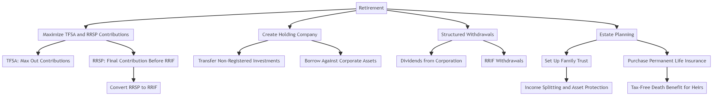

## Retirement Tax Strategy-

### Immediate Steps Upon Retirement

1. **Maximize TFSA and RRSP Contributions**:

   - **TFSA**: Ensure you have fully utilized your TFSA contribution room. If not, contribute the maximum allowable amount immediately upon retirement.
   - **RRSP**: If you have unused RRSP contribution room, consider making a final contribution before converting it to a RRIF (Registered Retirement Income Fund) at 71.

2. **Convert RRSP to RRIF**:

   - **RRIF**: Convert your RRSP to a RRIF to start drawing income. RRIF withdrawals are taxable, but mandatory minimum withdrawals can be managed to stay in a lower tax bracket.

3. **Incorporate for Tax Efficiency**:
   - **Create a Holding Company**: Transfer non-registered investments into a holding company to benefit from potential tax deferral and income splitting.
   - **Professional Corporation**: If applicable, use a professional corporation to manage any consulting or part-time work you might do post-retirement.

### Leveraging Investments

4. **Corporate Investments and Borrowing**:
   - **Invest Through Holding Company**: Place investments into the holding company for potential tax deferral.
   - **Borrow Against Corporate Assets**: Use the assets in your holding company to secure low-interest loans. This allows you to access funds without triggering capital gains taxes.

### Tax-Efficient Withdrawals

5. **Structured Withdrawals**:
   - **Dividends from Corporation**: Pay yourself dividends from the holding company, taking advantage of the dividend tax credit.
   - **RRIF Withdrawals**: Carefully plan RRIF withdrawals to minimize taxes.

### Estate Planning

6. **Trusts and Life Insurance**:
   - **Set Up a Family Trust**: Establish a family trust to manage and protect assets, providing income splitting opportunities and aiding in estate planning.
   - **Permanent Life Insurance**: Consider a permanent life insurance policy to provide a tax-free death benefit for your heirs. This can also help cover any taxes due on the estate.

### Example Strategy

1. **Transfer Investments to Holding Company**:

   - **Action**: Move non-registered investments into the holding company upon retirement.
   - **Benefit**: This helps in deferring taxes and managing investments more efficiently.

2. **Utilize TFSA and RRIF**:

   - **Action**: Max out TFSA contributions and convert RRSP to RRIF.
   - **Benefit**: Tax-free growth in TFSA and structured, lower-tax withdrawals from RRIF.

3. **Borrow Against Corporate Assets**:

   - **Action**: Use holding company assets to secure loans.
   - **Benefit**: Access funds without triggering capital gains taxes.

4. **Family Trust**:

   - **Action**: Establish a family trust to manage and protect assets.
   - **Benefit**: Income splitting and tax-efficient transfer of wealth to heirs.

5. **Life Insurance**:
   - **Action**: Purchase a permanent life insurance policy.
   - **Benefit**: Provides a tax-free death benefit, helping cover estate taxes and providing for heirs.

### Why This Strategy is Optimal for You

- **Tax Efficiency**: By using a holding company and trusts, you can defer and manage taxes effectively.
- **Asset Growth**: Investments within a holding company can grow tax-deferred, and borrowing against these assets provides liquidity.
- **Estate Planning**: Trusts and life insurance ensure a tax-efficient transfer of wealth to your heirs.

### Steps to Prepare Before Retirement

- **Consult a Financial Advisor**: Engage with a financial advisor to set up the necessary structures (holding company, trusts) and plan your final contributions to TFSA and RRSP.
- **Evaluate Life Insurance Options**: Look into permanent life insurance policies to lock in rates while you're still employed.

Implementing this strategy upon retirement allows you to maximize your financial and estate planning goals, ensuring you pay as little tax as possible and effectively transfer wealth to your heirs.
